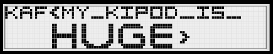

# Tupper needs help
Misc., 5 points

## Description
> I forgot the size of my kipod, can you help? k = [AWS_SECRET_REMOVED][AWS_SECRET_REMOVED][AWS_SECRET_REMOVED][AWS_SECRET_REMOVED][AWS_SECRET_REMOVED][AWS_SECRET_REMOVED][AWS_SECRET_REMOVED][AWS_SECRET_REMOVED][AWS_SECRET_REMOVED][AWS_SECRET_REMOVED][AWS_SECRET_REMOVED][AWS_SECRET_REMOVED][AWS_SECRET_REMOVED]694978239798720856064

## Solution

Searching for "Tupper" in the context of CTFs, we arrive to [Tupper's Self-Referential Formula](https://en.wikipedia.org/wiki/Tupper's_self-referential_formula):

> Tupper's self-referential formula is a formula that visually represents itself when graphed at a specific location in the (x, y) plane. 

[This online tool](http://keelyhill.github.io/tuppers-formula/) allows users to view a visual representation, given the value of `k`.

The result for the provided `k` is:

The flag: `KAF{MY_KIPOD_IS_HUGE}`