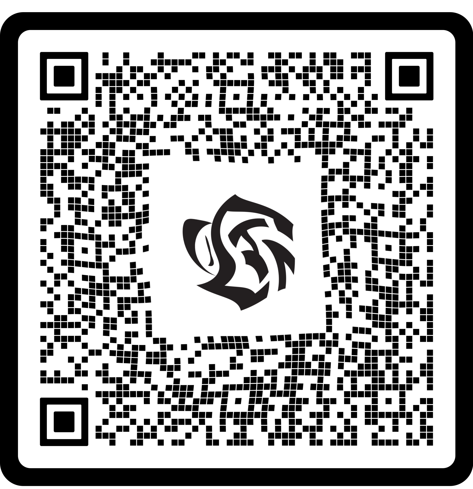
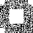
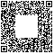

# QR code
Network

## QR recovery (150 points)

> Woops, our graphic designer added some special effects, and now it looks like it's not possible to scan our QR code anymore... Can you recover it?

The following file was provided:


This looks like a QR code for which a twirl effect was applied to. Obviously a QR reader can't read this and we need to reverse the effect.

Without an expensive Photoshop license, one has to resort to less advances image processing software. GIMP is usually the recommended alternative, but it suffers from a highly unintuitive user interface and is really frustrating to use. Some online tools, such as [Photopea](https://www.photopea.com/) are sometimes a better choice.

Using Photopea, it's possible to perform a counter-twirl (Filter -> Distort -> Twirl) and bring the image to the following state:



This is much better, but QR scanners still can't handle it. 

There probably is a programmatic solution, but at this stage I was leading the board with less than 24 hours to go, and I assumed that this challenge will provide a safe distance from the second place (spoiler: It didn't). So I went for the fastest solution I could think of - manually translating the QR code to zeroes and ones:

```
[AWS_SECRET_REMOVED]01100111000000000
[AWS_SECRET_REMOVED]01110001000000000
[AWS_SECRET_REMOVED]10110111000000000
[AWS_SECRET_REMOVED]10110101000000000
[AWS_SECRET_REMOVED]01000001000000000
[AWS_SECRET_REMOVED]01010010000000000
[AWS_SECRET_REMOVED]10101010100000000
[AWS_SECRET_REMOVED]00010101000000000
[AWS_SECRET_REMOVED]11011001101101000
[AWS_SECRET_REMOVED]10010110000011000
[AWS_SECRET_REMOVED]11111011011110000
[AWS_SECRET_REMOVED]01001000000100101
[AWS_SECRET_REMOVED]01011100110100101
[AWS_SECRET_REMOVED]11110001000101011
[AWS_SECRET_REMOVED]11101111001011000
[AWS_SECRET_REMOVED]01000101010101101
[AWS_SECRET_REMOVED]01001001010011001
[AWS_SECRET_REMOVED]00111001101011000
[AWS_SECRET_REMOVED]01101111001011001
[AWS_SECRET_REMOVED]01000101010001011
[AWS_SECRET_REMOVED]01001000000110101
[AWS_SECRET_REMOVED]01111100000011000
[AWS_SECRET_REMOVED]00101010110110001
[AWS_SECRET_REMOVED]01100001010110001
[AWS_SECRET_REMOVED]01001100100001010
[AWS_SECRET_REMOVED]01111001100010010
[AWS_SECRET_REMOVED]01101111111111101
[AWS_SECRET_REMOVED]01010101100010001
[AWS_SECRET_REMOVED]01000100101011101
[AWS_SECRET_REMOVED]01001000100011000
[AWS_SECRET_REMOVED]00101000111111001
[AWS_SECRET_REMOVED]01011100101100101
[AWS_SECRET_REMOVED]01011001001011101
[AWS_SECRET_REMOVED]00111101100101011
[AWS_SECRET_REMOVED]00101001111101000
[AWS_SECRET_REMOVED]01010100011101001
[AWS_SECRET_REMOVED]00011000101111101
[AWS_SECRET_REMOVED]01001011101101011
[AWS_SECRET_REMOVED]01101001111000011
[AWS_SECRET_REMOVED]01000000111101001
[AWS_SECRET_REMOVED]01000111001010101
[AWS_SECRET_REMOVED]10101000101101011
[AWS_SECRET_REMOVED]11100111000101000
[AWS_SECRET_REMOVED]01010101111100001
[AWS_SECRET_REMOVED]10011101101011001
[AWS_SECRET_REMOVED]11010011101100011
[AWS_SECRET_REMOVED]11001111110101011
[AWS_SECRET_REMOVED]10010100110101101
[AWS_SECRET_REMOVED]11010101111111001
[AWS_SECRET_REMOVED]10001111100010000
[AWS_SECRET_REMOVED]11101000101010011
[AWS_SECRET_REMOVED]01000101100010101
[AWS_SECRET_REMOVED]11010101111111011
[AWS_SECRET_REMOVED]10001001100101010
[AWS_SECRET_REMOVED]10101100010100011
[AWS_SECRET_REMOVED]00010100100001011
[AWS_SECRET_REMOVED]10111100111101101
```

With this data, it's possible to write a short script which will translate it to an image:

```python
from PIL import Image
  
limit = 57
img = Image.new(mode = "RGB", size = (limit, limit) )
pixels = img.load()

with open("qr.txt") as f:
    y = 0
    for line in f:
        line = line.rstrip()
        for x, b in enumerate(line):
            if b == "0":
                pixels[x,y] = (255, 255, 255)
            elif b == "1":
                pixels[x,y] = (0, 0, 0)
            else:
                raise Exception("")
        y += 1
img.save('qr_out.png')
```

The result is:



We can now use an image editor to manually add the reference points:



Now QR scanners can recognize the data:
```console
root@kali:/media/sf_CTFs/hackazon/QR_code# zbarimg qr_out2.png
QR-Code:You have solved the impossible QR code! Submit your solution at https://cybertechtlv.hackazon.org with this code: CTF{QRmaster_cybertech}
scanned 1 barcode symbols from 1 images in 0.02 seconds
```