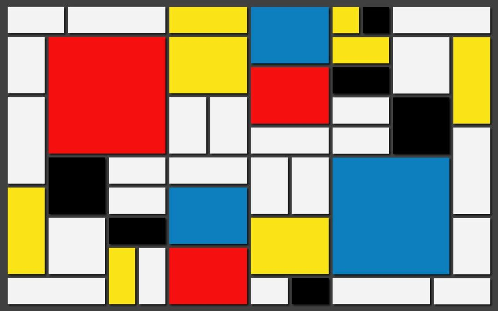

# Shenzhen - Office
Category: Misc.

## Description

> You’re exiting a crowded subway nearby the office that you are about to visit. You are showing the guards your ID and answering a couple of routine questions. They are not impressed, but the gate opens up and you can enter the area despite their doubt. You are not allowed to stroll freely on the company grounds, but are shown around by a woman that stares at you with a crooked smile. At last you're able to talk to the manager, a short man with a white robe and shades: "Greetings, AGENT, You must be thirsty after your long journey? No? You don’t mind if I’ll have something for myself, do you? Good! We have heard about the device that you possess, can I have a look at it. Hmm, it seems that it is encrypted. Help me break this quickly so that we can continue with the analysis."
> 
> Challenge: To the moon (misc)
> 
> This one is a doozie. We found this weird file on a memory stick with a post-it note on it. It looks like someone was working on a very obscure encryption system. Maybe we can decode it?

Two files were attached: `chall.txt` and `encodings`.

## Solution

This challenge wasn't trivial and I got a few hints for it.

Let's check the attached files:

`encodings`:

```
I made a super secret encoder. I remember using:
- a weird base, much higher than base64
- a language named after a painter
- a language that is the opposite of good
- a language that looks like a rainbow cat
- a language that is too vulgar to write here
- a language that ended in 'ary' but I don't remember the full name

I also use gzip and zlib (to compress the stuff) and I like hiding things in files...
```

`chall.txt` (showing only beginning):

```console
┌──(user@kali)-[/media/sf_CTFs/google/6_Shenzhen_-_Office/download]
└─$ cat chall.txt| head -c 258
魦浤魦敥攰攱阴欴渴欴攰昰昰攰攰昰攰昰攰攰魦晥昸阶樴洷渶欶攰攰餴餴攰防攰攰攰洰攰樰昰阱攰樰攰攰攰昰攰攰攰阴昰霱攰樰攰攰攰昰攰攰攰朵昰洲攰栰攰攰攰昰攰昰攰攰昰霳攰朰攰攰昸洰攰攰
┌──(user@kali)-[/media/sf_CTFs/google/6_Shenzhen_-_Office/download]
└─$ xxd -g 1 chall.txt | head
00000000: e9 ad a6 e6 b5 a4 e9 ad a6 e6 95 a5 e6 94 b0 e6  ................
00000010: 94 b1 e9 98 b4 e6 ac b4 e6 b8 b4 e6 ac b4 e6 94  ................
00000020: b0 e6 98 b0 e6 98 b0 e6 94 b0 e6 94 b0 e6 98 b0  ................
00000030: e6 94 b0 e6 98 b0 e6 94 b0 e6 94 b0 e9 ad a6 e6  ................
00000040: 99 a5 e6 98 b8 e9 98 b6 e6 a8 b4 e6 b4 b7 e6 b8  ................
00000050: b6 e6 ac b6 e6 94 b0 e6 94 b0 e9 a4 b4 e9 a4 b4  ................
00000060: e6 94 b0 e9 98 b2 e6 94 b0 e6 94 b0 e6 94 b0 e6  ................
00000070: b4 b0 e6 94 b0 e6 a8 b0 e6 98 b0 e9 98 b1 e6 94  ................
00000080: b0 e6 a8 b0 e6 94 b0 e6 94 b0 e6 94 b0 e6 98 b0  ................
00000090: e6 94 b0 e6 94 b0 e6 94 b0 e9 98 b4 e6 98 b0 e9  ................
┌──(user@kali)-[/media/sf_CTFs/google/6_Shenzhen_-_Office/download]
└─$ wc -c chall.txt
261846 chall.txt
```

Remember the first clue: *a weird base, much higher than base64*. 
There are only so many encodings larger than `64`. [Base65536](https://github.com/qntm/base65536) is one of them, and it turns out it can decode the file:

```python
>>> import base65536
>>> with open("download/chall.txt", encoding="utf8") as f, open("out1.bin", "wb") as o:
...     o.write(base65536.decode(f.read()))
...
174564
```

We get:

```console
┌──(user@kali)-[/media/sf_CTFs/google/6_Shenzhen_-_Office]
└─$ file out1.bin
out1.bin: ASCII text, with very long lines, with no line terminators

┌──(user@kali)-[/media/sf_CTFs/google/6_Shenzhen_-_Office]
└─$ head -c 100 out1.bin
[AWS_SECRET_REMOVED][AWS_SECRET_REMOVED]011a0005000000010000

┌──(user@kali)-[/media/sf_CTFs/google/6_Shenzhen_-_Office]
└─$ cat out1.bin | sed 's/./&\n/g' | LC_COLLATE=C sort -u | tr -d '\n'
0123456789abcdef
```

So this is a HEX encoding, let's decode it:

```console
┌──(user@kali)-[/media/sf_CTFs/google/6_Shenzhen_-_Office]
└─$ cat out1.bin | xxd -p -r > out2.bin

┌──(user@kali)-[/media/sf_CTFs/google/6_Shenzhen_-_Office]
└─$ file out2.bin
out2.bin: JPEG image data, JFIF standard 1.01, aspect ratio, density 1x1, segment length 16, Exif Standard: [TIFF image data, big-endian, direntries=5, xresolution=74, yresolution=82, resolutionunit=1], baseline, precision 8, 1131x707, components 3
```

We got a JPEG image:



Using Google Images, this seems to be a famous painting by the geometric abstract art pioneer [Piet Mondrian](https://en.wikipedia.org/wiki/Piet_Mondrian). Remember the second clue: *a language named after a painter*. There actually is an esoteric language named after this painter: [Piet](https://esolangs.org/wiki/Piet). However, since no Piet tool seems to be able to parse the JEPG file, we look elsewhere, and with the help of `exiftool` we notice a strange `artist` field:

```console
┌──(user@kali)-[/media/sf_CTFs/google/6_Shenzhen_-_Office]
└─$ exiftool out2.jpg | grep Artist | head -c 100
Artist                          : [AWS_SECRET_REMOVED]uuuwuwuuuwaawaawaaaawueuee
```

Remember the clue: *a language that is the opposite of good*. That must be [evil](https://esolangs.org/wiki/Evil). So, we visit the [evil Programming Language Homepage](http://web.archive.org/web/20070103000858/www1.pacific.edu/~twrensch/evil/index.html), grab the [Java implementation](http://web.archive.org/web/20070906133127/http://www1.pacific.edu/~twrensch/evil/evil.java), modify it a bit and run it on the extracted evil artist. Since the output turns out to be hex, we'll pipe it through `xxd` to create a binary:

```
┌──(user@kali)-[/media/sf_CTFs/google/6_Shenzhen_-_Office]
└─$ javac evil.java

┌──(user@kali)-[/media/sf_CTFs/google/6_Shenzhen_-_Office]
└─$ java evil <(exiftool out2.jpg | grep Artist | awk '{ printf $3 }') | xxd -p -r > out3.bin

┌──(user@kali)-[/media/sf_CTFs/google/6_Shenzhen_-_Office]
└─$ file out3.bin
out3.bin: zlib compressed data
```

We got `zlib` compressed data, let's inflate it:

```console
┌──(user@kali)-[/media/sf_CTFs/google/6_Shenzhen_-_Office]
└─$ zlib-flate -uncompress < out3.bin > out4.bin

┌──(user@kali)-[/media/sf_CTFs/google/6_Shenzhen_-_Office]
└─$ file out4.bin
out4.bin: gzip compressed data, last modified: Thu Jul 15 08:21:18 2021, max compression, original size modulo 2^32 701584
```

Now we get a `gzip` archive:

```console
┌──(user@kali)-[/media/sf_CTFs/google/6_Shenzhen_-_Office]
└─$ mv out4.bin out4.gz

┌──(user@kali)-[/media/sf_CTFs/google/6_Shenzhen_-_Office]
└─$ gunzip out4.gz

┌──(user@kali)-[/media/sf_CTFs/google/6_Shenzhen_-_Office]
└─$ file out4
out4: Netpbm image data, size = 1827 x 128, rawbits, pixmap
```

We get an image file, and now it's time for `piet` (using [Pyet](https://github.com/jdherg/pyet) - a Python interpreter):

```console
┌──(user@kali)-[/media/sf_CTFs/google/6_Shenzhen_-_Office/pyet]
└─$ python3 image_to_source.py ../out4 > ../out4.pyet

┌──(user@kali)-[/media/sf_CTFs/google/6_Shenzhen_-_Office/pyet]
└─$ python3 pyet.py ../out4.pyet > ../out5.bin
^C
```

`pyet` is a bit buggy and we need to kill it after a few seconds, it pads the output with `0x01` and we need to remove that:

```console
┌──(user@kali)-[/media/sf_CTFs/google/6_Shenzhen_-_Office]
└─$ cat out5.bin | tr -d '\01'
[AWS_SECRET_REMOVED][AWS_SECRET_REMOVED][AWS_SECRET_REMOVED][AWS_SECRET_REMOVED][AWS_SECRET_REMOVED][AWS_SECRET_REMOVED][AWS_SECRET_REMOVED][AWS_SECRET_REMOVED][AWS_SECRET_REMOVED][AWS_SECRET_REMOVED][AWS_SECRET_REMOVED][AWS_SECRET_REMOVED][AWS_SECRET_REMOVED][AWS_SECRET_REMOVED][AWS_SECRET_REMOVED][AWS_SECRET_REMOVED][AWS_SECRET_REMOVED][AWS_SECRET_REMOVED][AWS_SECRET_REMOVED][AWS_SECRET_REMOVED][AWS_SECRET_REMOVED][AWS_SECRET_REMOVED]47f0ff778d3ba34a6b73dd5f8feb8435

┌──(user@kali)-[/media/sf_CTFs/google/6_Shenzhen_-_Office]
└─$ cat out5.bin | tr -d '\01' | xxd -p -r > out6.bin

┌──(user@kali)-[/media/sf_CTFs/google/6_Shenzhen_-_Office]
└─$ file out6.bin
out6.bin: zlib compressed data
```

`zlib` again:

```console
┌──(user@kali)-[/media/sf_CTFs/google/6_Shenzhen_-_Office]
└─$ zlib-flate -uncompress < out6.bin > out7.bin

┌──(user@kali)-[/media/sf_CTFs/google/6_Shenzhen_-_Office]
└─$ file out7.bin
out7.bin: ASCII text

┌──(user@kali)-[/media/sf_CTFs/google/6_Shenzhen_-_Office]
└─$ cat out7.bin| head
[AWS_SECRET_REMOVED]yyyyyyyyyyyyyya~
[AWS_SECRET_REMOVED]yyyyyyyyyyyyyya~
[AWS_SECRET_REMOVED]yyyyyyyyyya~
[AWS_SECRET_REMOVED]yyyyyyyyyyyyyyyya~
[AWS_SECRET_REMOVED]yyyyyyyyyyyyyyyyyyya~
[AWS_SECRET_REMOVED]yyyyyyyyyyyyyyyyya~
[AWS_SECRET_REMOVED]yyyyyyyyyyyyyyyyyyya~
[AWS_SECRET_REMOVED]yyyyyyyyyyya~
[AWS_SECRET_REMOVED]yyyyyyyyyyyyyyyyyya~
[AWS_SECRET_REMOVED]yyyyyyyyyyyyyya~
```

Remember the hint: *a language that looks like a rainbow cat*. That must be [nya~](https://esolangs.org/wiki/Nya~). We'll use the official interpreter from [here](https://github.com/sech1p/nya.git).

```console
┌──(user@kali)-[/media/sf_CTFs/google/6_Shenzhen_-_Office]
└─$ nya/build/nya out7.bin
[AWS_SECRET_REMOVED][AWS_SECRET_REMOVED][AWS_SECRET_REMOVED][AWS_SECRET_REMOVED][AWS_SECRET_REMOVED][AWS_SECRET_REMOVED][AWS_SECRET_REMOVED][AWS_SECRET_REMOVED][AWS_SECRET_REMOVED][AWS_SECRET_REMOVED]58356951704469327595398462722928801
```

Notice that this doesn't look like HEX:

```console
┌──(user@kali)-[/media/sf_CTFs/google/6_Shenzhen_-_Office]
└─$ nya/build/nya out7.bin | sed 's/./&\n/g' | LC_COLLATE=C sort -u | tr -d '\n'
0123456789
```

This is the real tricky part. Remember the hint: *a language that ended in 'ary' but I don't remember the full name*. Now, it turns out this language is actually [Golunar](https://esolangs.org/wiki/Golunar), which is a derivative of [Unary](https://esolangs.org/wiki/Unary). We can translate it to [Brainfuck](https://esolangs.org/wiki/Brainfuck) (*a language that is too vulgar to write here*) using [this script](https://codegolf.stackexchange.com/questions/52712/brainfk-to-unary-and-back/185968):

```python
>>> a=[AWS_SECRET_REMOVED][AWS_SECRET_REMOVED][AWS_SECRET_REMOVED][AWS_SECRET_REMOVED][AWS_SECRET_REMOVED][AWS_SECRET_REMOVED][AWS_SECRET_REMOVED][AWS_SECRET_REMOVED][AWS_SECRET_REMOVED][AWS_SECRET_REMOVED]58356951704469327595398462722928801
>>> print (''.join("><+-.,[]"[int(i)]for i in oct(a)[2:]if'L'>i))
<[-]>[-]<++++++[>++++++++++<-]>+++++++.<+[>++++++++++<-]>+++++++.<+[>----------<-]>----.<+++++[>++++++++++<-]>+++.<+[>----------<-]>-.<[>----------<-]>----.<+++++[>----------<-]>-------.<[>++++++++++<-]>+.<++++++[>++++++++++<-]>+++.<++++++[>----------<-]>----.<++++[>++++++++++<-]>++++.<+[>++++++++++<-]>+++++.<++++++[>----------<-]>--.<++++[>++++++++++<-]>+++++++.<+[>++++++++++<-]>++++.<++++++[>----------<-]>-.<[>++++++++++<-]>++++.<++++++[>++++++++++<-]>++.<+[>++++++++++<-]>+.<
```

Finally, we execute the Brainfuck script with any [online interpreter](https://www.dcode.fr/brainfuck-language), and get the flag: `CTF{pl34s3_n0_m04r}`.