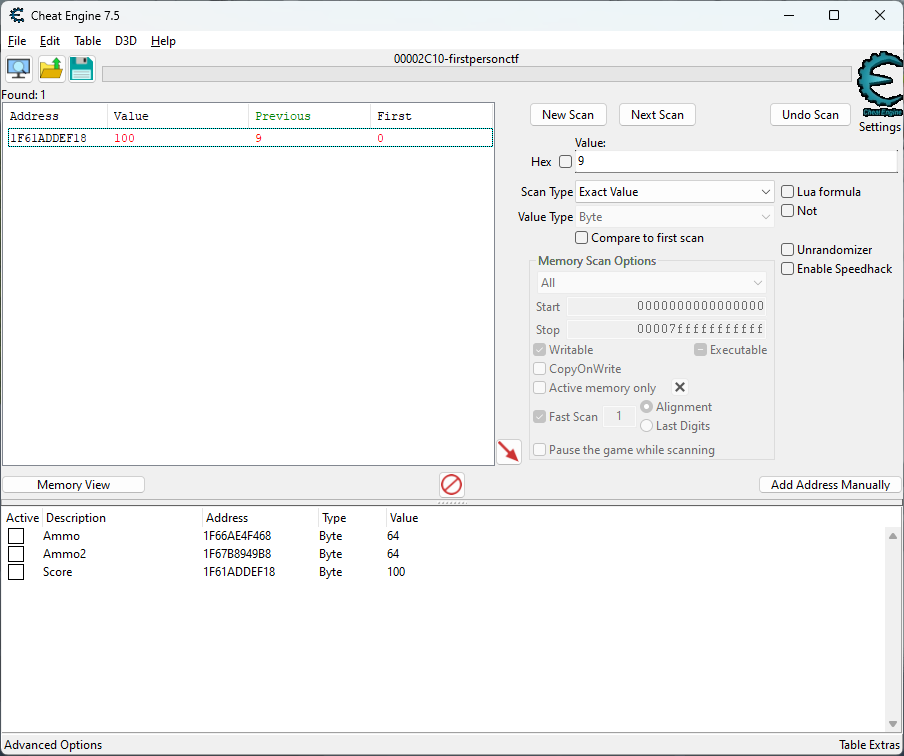
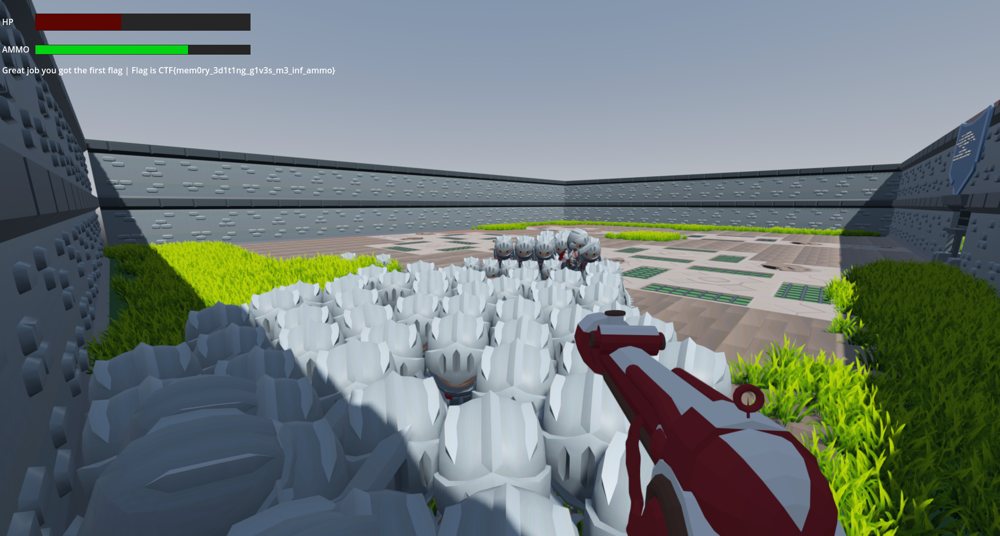

# First Person (Part I)

Category: Reversing

## Description

> You have landed in a space time anomaly. Evil AI spawning around you, do you think you can kill them all to get the first flag?

An executable was attached.

## Solution

Running the executable, we see it's a simple game built using Godot engine:

```console
C:\Game> .\firstpersonctf.exe
Godot Engine v4.2.1.stable.custom_build.b09f793f5 - https://godotengine.org
```

We control a hero, trapped in a small arena and surrounded by knights (while more and more keep
spawning). The hero must shoot and kill the knights which are trying to attack him, but has 
limited ammo and health.

> You have landed in a time-space anomaly. Evil AI spawns around you, kill 101 of them to 
> get the first flag (there are multiple).
>
> Think out of the box. Remember, this is a hacking challenge.

After playing for a short while, we discover that it's possible to jump onto the swarm of 
knights, and actually stand on them. This way, they aren't really able to hurt us, and we can
kill them one by one. There are two problems with this plan, though: First, we have limited ammo,
not enough to kill all 101 knights needed, and second, it takes a pretty long time (and the
game crashes from time to time). So, we will hack it.

The classic tool for this kind of task is Cheat Engine.

> Cheat Engine (CE) is a proprietary, source available freeware memory scanner/debugger 
> created by Eric Heijnen ("Byte, Darke") for the Windows operating system in 2000.
> Cheat Engine is mostly used for cheating in computer games and is sometimes modified 
> and recompiled to support new games. It searches for values input by the user with a 
> wide variety of options that allow the user to find and sort through the computer's memory.

Using CE, we can try to locate the exact memory location for various game attributes and modify
them at runtime. One approach would be to try and locate the ammo variable, by scanning for a
value which decreases by one after each gunshot. However, it is much faster to locate the variable
responsible for holding the score, i.e. the number of knights we've killed. We start with an 
initial scan, searching for the exact value of `0`, then kill a few knights (say, three) and
scan for a memory slot which changed to `3`, kill a few more and scan for that value, and so
on. Eventually we should have just one address, and we can modify its content to hold a much 
higher score (say, `100`). 



The next knight we kill will give us the flag:



The flag: `CTF{mem0ry_3d1t1ng_g1v3s_m3_inf_ammo}`

