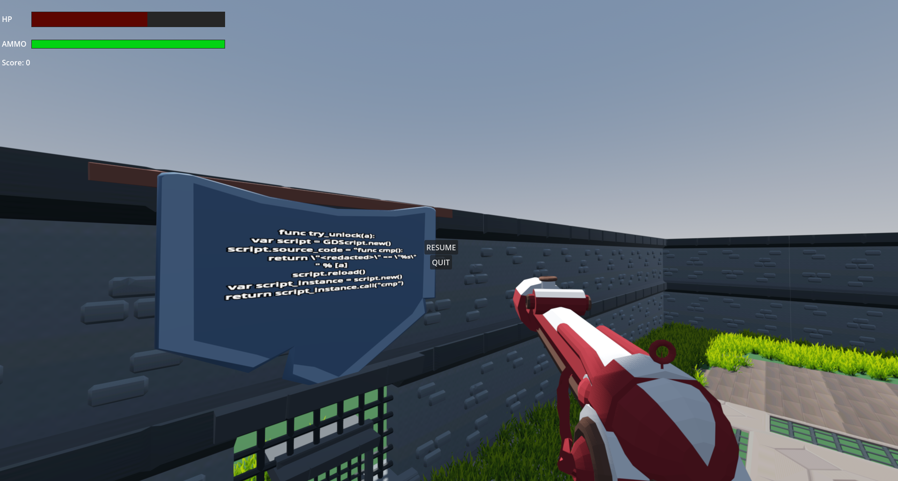
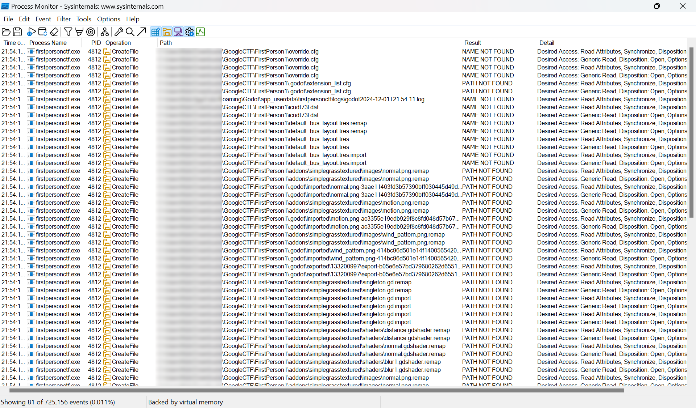
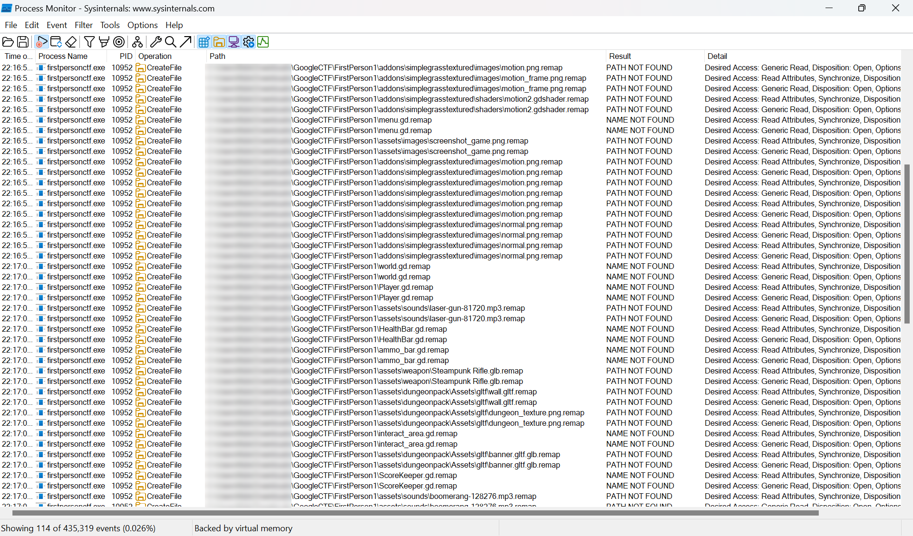
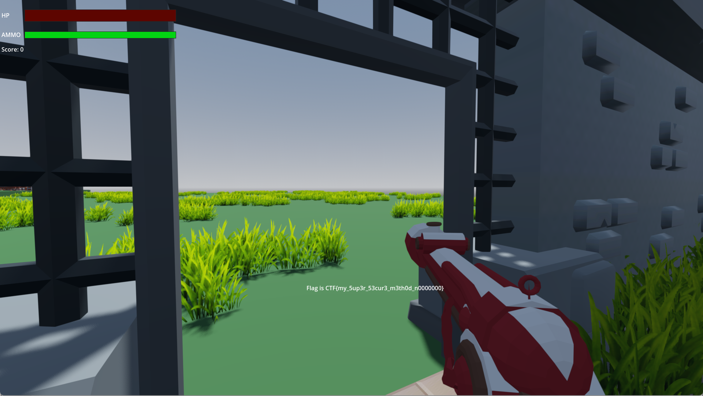

# First Person (Part II)

Category: Reversing

## Description

> Escape the walls of simulation, get the next flag. Same game attachment as Part I

## Solution

We need to somehow escape the arena. There's a gate to the arena, and when we approach
it we are prompted to enter a password. We don't know the password, of course, but
above it there's a very useful sign:



This must be the implementation for the password comparison. While the important part is
redacted, it does give us a very big push in the right direction. Searching for some keywords
found in the script leads us to [this](https://github.com/godotengine/godot/issues/22814) GitHub
issue, which might have inspired the code. If we could just overwrite the original implementation
with our own, we would be able to always return `True` and open the gate without knowing the 
password. But how do we inject our own code into the game runtime without the sources available?

One way would be to try and decompile the game binary. There are projects to support that 
(such as [gdsdecomp](https://github.com/GDRETools/gdsdecomp)) but it turns out that the project
is encrypted, and while finding the key is theoretically possible (since it's apparently 
embedded into the binary), it seems like it's too complex for the scope of the challenge.  
If the challenge creators were nice to us, though, they possibly would have included in the 
game some logic that tries to read a source file from the disk during runtime, right?

We can check which resources the game is trying to access using Process Monitor. To reduce our
results, we only look at files which the game tried to open (`'Operation' == 'CreateFile'`) but
were not found (`'Result' contains 'NOT FOUND'`):



Turns out the challenge creators didn't have to do anything special, since reading about
`override.cfg`, `extension_list.cfg` and the different `*.remap` files, we discover that these
are all built right into Godot!

Reading about all three types of files, we learn that the `remap` files are most useful as
they allow us to extend or overwrite functionality in the original game. So, we filter the `remap` 
and get a list of possible targets:



From these, `world`, `Player`, `interact_area` seem like the most reasonable places to implement
the `try_lock` function. We can try all, or use some extra code to dump each of their function
list (using `get_script_method_list`). Long story short, `try_unlock` is implemented in `player`, 
and we override it by creating a file called `player.gd.remap` with the following contents:

```
[remap]
path="res://player_override.gd"
```

Then, we create `player_override.gd` in the same directory with:

```
extends "res://Player.gd"

func try_unlock(a):
	var script = GDScript.new()
	script.source_code = "func cmp():\n\treturn 1==1"
	script.reload()
	var script_instance = script.new()
	return script_instance.call("cmp")
```

Now, when we run the game and approach the gate, we are able to enter any password and get the
next flag:



The flag: `CTF{my_5up3r_53cur3_m3th0d_n0000000}`