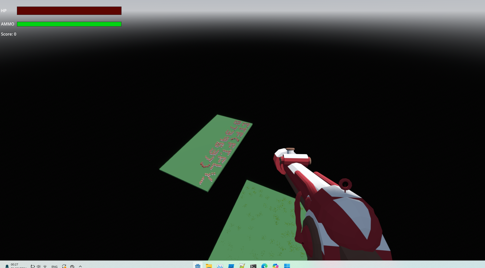

# First Person (Part III)

Category: Reversing

## Description

> Sometimes you need a bird's eye view to see everything the world has to offer. Same game attachment as part I and II

## Solution

So, we need to fly. This probably means to somehow change the player's attributes. We'll need
to dump them first.

To dump them, we'll create `override.cfg` with the following content:

```
[autoload]
custom_script="res://script.gd"
```

This will load `script.gd` on startup, so we create it with the following content:

```
extends Node

func _ready():
	print("User Script Running!")
	var root = get_parent()
	var original: Node = preload("res://Player.gd").new()
	var script = original.get_script()
	if script:
		print(script.get_script_method_list())
		print(original.get_property_list())
```

If we start the executable from the command line, we get the following dump:

```
User Script Running!
[{ "name": "_ready", "args": [], "default_args": [], "flags": 1, "id": 0, "return": { "name": "", "class_name": &"", "type": 0, "hint": 0, "hint_string": "", "usage": 6 } }, { "name": "add_this", "args": [{ "name": "string", "class_name": &"", "type": 0, "hint": 0, "hint_string": "", "usage": 131072 }, { "name": "key", "class_name": &"", "type": 0, "hint": 0, "hint_string": "", "usage": 131072 }], "default_args": [], "flags": 1, "id": 0, "return": { "name": "", "class_name": &"", "type": 0, "hint": 0, "hint_string": "", "usage": 131072 } }, { "name": "_unhandled_input", "args": [{ "name": "event", "class_name": &"", "type": 0, "hint": 0, "hint_string": "", "usage": 131072 }], "default_args": [], "flags": 1, "id": 0, "return": { "name": "", "class_name": &"", "type": 0, "hint": 0, "hint_string": "", "usage": 6 } }, { "name": "_physics_process", "args": [{ "name": "delta", "class_name": &"", "type": 0, "hint": 0, "hint_string": "", "usage": 131072 }], "default_args": [], "flags": 1, "id": 0, "return": { "name": "", "class_name": &"", "type": 0, "hint": 0, "hint_string": "", "usage": 6 } }, { "name": "_headbob", "args": [{ "name": "time", "class_name": &"", "type": 0, "hint": 0, "hint_string": "", "usage": 131072 }], "default_args": [], "flags": 1, "id": 0, "return": { "name": "", "class_name": &"", "type": 9, "hint": 0, "hint_string": "", "usage": 0 } }, { "name": "interract_with_gate_in", "args": [], "default_args": [], "flags": 1, "id": 0, "return": { "name": "", "class_name": &"", "type": 0, "hint": 0, "hint_string": "", "usage": 6 } }, { "name": "interract_with_gate_out", "args": [], "default_args": [], "flags": 1, "id": 0, "return": { "name": "", "class_name": &"", "type": 0, "hint": 0, "hint_string": "", "usage": 6 } }, { "name": "playerdie", "args": [], "default_args": [], "flags": 1, "id": 0, "return": { "name": "", "class_name": &"", "type": 0, "hint": 0, "hint_string": "", "usage": 6 } }, { "name": "hit", "args": [{ "name": "dir", "class_name": &"", "type": 0, "hint": 0, "hint_string": "", "usage": 131072 }], "default_args": [], "flags": 1, "id": 0, "return": { "name": "", "class_name": &"", "type": 0, "hint": 0, "hint_string": "", "usage": 6 } }, { "name": "_on_quit_pressed", "args": [], "default_args": [], "flags": 1, "id": 0, "return": { "name": "", "class_name": &"", "type": 0, "hint": 0, "hint_string": "", "usage": 6 } }, { "name": "_on_resume_pressed", "args": [], "default_args": [], "flags": 1, "id": 0, "return": { "name": "", "class_name": &"", "type": 0, "hint": 0, "hint_string": "", "usage": 6 } }, { "name": "try_unlock", "args": [{ "name": "a", "class_name": &"", "type": 0, "hint": 0, "hint_string": "", "usage": 131072 }], "default_args": [], "flags": 1, "id": 0, "return": { "name": "", "class_name": &"", "type": 0, "hint": 0, "hint_string": "", "usage": 131072 } }, { "name": "_on_line_edit_text_submitted", "args": [{ "name": "new_text", "class_name": &"", "type": 0, "hint": 0, "hint_string": "", "usage": 131072 }], "default_args": [], "flags": 1, "id": 0, "return": { "name": "", "class_name": &"", "type": 0, "hint": 0, "hint_string": "", "usage": 6 } }]
[{ "name": "Node", "class_name": &"", "type": 0, "hint": 0, "hint_string": "Node", "usage": 128 }, { "name": "_import_path", "class_name": &"", "type": 22, "hint": 0, "hint_string": "", "usage": 10 }, { "name": "name", "class_name": &"", "type": 21, "hint": 0, "hint_string": "", "usage": 0 }, { "name": "unique_name_in_owner", "class_name": &"", "type": 1, "hint": 0, "hint_string": "", "usage": 2 }, { "name": "scene_file_path", "class_name": &"", "type": 4, "hint": 0, "hint_string": "", "usage": 0 }, { "name": "owner", "class_name": &"Node", "type": 24, "hint": 17, "hint_string": "Node", "usage": 0 }, { "name": "multiplayer", "class_name": &"MultiplayerAPI", "type": 24, "hint": 17, "hint_string": "MultiplayerAPI", "usage": 0 }, { "name": "Process", "class_name": &"", "type": 0, "hint": 0, "hint_string": "process_", "usage": 64 }, { "name": "process_mode", "class_name": &"", "type": 2, "hint": 2, "hint_string": "Inherit,Pausable,When Paused,Always,Disabled", "usage": 6 }, { "name": "process_priority", "class_name": &"", "type": 2, "hint": 0, "hint_string": "", "usage": 6 }, { "name": "process_physics_priority", "class_name": &"", "type": 2, "hint": 0, "hint_string": "", "usage": 6 }, { "name": "Thread Group", "class_name": &"", "type": 0, "hint": 0, "hint_string": "process_thread", "usage": 256 }, { "name": "process_thread_group", "class_name": &"", "type": 2, "hint": 2, "hint_string": "Inherit,Main Thread,Sub Thread", "usage": 6 }, { "name": "process_thread_group_order", "class_name": &"", "type": 2, "hint": 0, "hint_string": "", "usage": 0 }, { "name": "process_thread_messages", "class_name": &"", "type": 2, "hint": 6, "hint_string": "Process,Physics Process", "usage": 0 }, { "name": "Editor Description", "class_name": &"", "type": 0, "hint": 0, "hint_string": "editor_", "usage": 64 }, { "name": "editor_description", "class_name": &"", "type": 4, "hint": 18, "hint_string": "", "usage": 6 }, { "name": "Node3D", "class_name": &"", "type": 0, "hint": 0, "hint_string": "Node3D", "usage": 128 }, { "name": "Transform", "class_name": &"", "type": 0, "hint": 0, "hint_string": "", "usage": 64 }, { "name": "transform", "class_name": &"", "type": 18, "hint": 0, "hint_string": "suffix:m", "usage": 2 }, { "name": "global_transform", "class_name": &"", "type": 18, "hint": 0, "hint_string": "suffix:m", "usage": 0 }, { "name": "position", "class_name": &"", "type": 9, "hint": 1, "hint_string": "-99999,99999,0.001,or_greater,or_less,hide_slider,suffix:m", "usage": 4 }, { "name": "rotation", "class_name": &"", "type": 9, "hint": 1, "hint_string": "-360,360,0.1,or_less,or_greater,radians_as_degrees", "usage": 4 }, { "name": "rotation_degrees", "class_name": &"", "type": 9, "hint": 0, "hint_string": "", "usage": 0 }, { "name": "quaternion", "class_name": &"", "type": 15, "hint": 35, "hint_string": "", "usage": 0 }, { "name": "basis", "class_name": &"", "type": 17, "hint": 0, "hint_string": "", "usage": 0 }, { "name": "scale", "class_name": &"", "type": 9, "hint": 5, "hint_string": "", "usage": 4 }, { "name": "rotation_edit_mode", "class_name": &"", "type": 2, "hint": 2, "hint_string": "Euler,Quaternion,Basis", "usage": 6 }, { "name": "rotation_order", "class_name": &"", "type": 2, "hint": 2, "hint_string": "XYZ,XZY,YXZ,YZX,ZXY,ZYX", "usage": 6 }, { "name": "top_level", "class_name": &"", "type": 1, "hint": 0, "hint_string": "", "usage": 6 }, { "name": "global_position", "class_name": &"", "type": 9, "hint": 0, "hint_string": "", "usage": 0 }, { "name": "global_basis", "class_name": &"", "type": 17, "hint": 0, "hint_string": "", "usage": 0 }, { "name": "global_rotation", "class_name": &"", "type": 9, "hint": 0, "hint_string": "", "usage": 0 }, { "name": "global_rotation_degrees", "class_name": &"", "type": 9, "hint": 0, "hint_string": "", "usage": 0 }, { "name": "Visibility", "class_name": &"", "type": 0, "hint": 0, "hint_string": "", "usage": 64 }, { "name": "visible", "class_name": &"", "type": 1, "hint": 0, "hint_string": "", "usage": 6 }, { "name": "visibility_parent", "class_name": &"", "type": 22, "hint": 26, "hint_string": "GeometryInstance3D", "usage": 6 }, { "name": "CollisionObject3D", "class_name": &"", "type": 0, "hint": 0, "hint_string": "CollisionObject3D", "usage": 128 }, { "name": "disable_mode", "class_name": &"", "type": 2, "hint": 2, "hint_string": "Remove,Make Static,Keep Active", "usage": 6 }, { "name": "Collision", "class_name": &"", "type": 0, "hint": 0, "hint_string": "collision_", "usage": 64 }, { "name": "collision_layer", "class_name": &"", "type": 2, "hint": 11, "hint_string": "", "usage": 6 }, { "name": "collision_mask", "class_name": &"", "type": 2, "hint": 11, "hint_string": "", "usage": 6 }, { "name": "collision_priority", "class_name": &"", "type": 3, "hint": 0, "hint_string": "", "usage": 6 }, { "name": "Input", "class_name": &"", "type": 0, "hint": 0, "hint_string": "input_", "usage": 64 }, { "name": "input_ray_pickable", "class_name": &"", "type": 1, "hint": 0, "hint_string": "", "usage": 6 }, { "name": "input_capture_on_drag", "class_name": &"", "type": 1, "hint": 0, "hint_string": "", "usage": 6 }, { "name": "PhysicsBody3D", "class_name": &"", "type": 0, "hint": 0, "hint_string": "PhysicsBody3D", "usage": 128 }, { "name": "Axis Lock", "class_name": &"", "type": 0, "hint": 0, "hint_string": "axis_lock_", "usage": 64 }, { "name": "axis_lock_linear_x", "class_name": &"", "type": 1, "hint": 0, "hint_string": "", "usage": 6 }, { "name": "axis_lock_linear_y", "class_name": &"", "type": 1, "hint": 0, "hint_string": "", "usage": 6 }, { "name": "axis_lock_linear_z", "class_name": &"", "type": 1, "hint": 0, "hint_string": "", "usage": 6 }, { "name": "axis_lock_angular_x", "class_name": &"", "type": 1, "hint": 0, "hint_string": "", "usage": 6 }, { "name": "axis_lock_angular_y", "class_name": &"", "type": 1, "hint": 0, "hint_string": "", "usage": 6 }, { "name": "axis_lock_angular_z", "class_name": &"", "type": 1, "hint": 0, "hint_string": "", "usage": 6 }, { "name": "CharacterBody3D", "class_name": &"", "type": 0, "hint": 0, "hint_string": "CharacterBody3D", "usage": 128 }, { "name": "motion_mode", "class_name": &"", "type": 2, "hint": 2, "hint_string": "Grounded,Floating", "usage": 16390 }, { "name": "up_direction", "class_name": &"", "type": 9, "hint": 0, "hint_string": "", "usage": 6 }, { "name": "slide_on_ceiling", "class_name": &"", "type": 1, "hint": 0, "hint_string": "", "usage": 6 }, { "name": "velocity", "class_name": &"", "type": 9, "hint": 0, "hint_string": "suffix:m/s", "usage": 2 }, { "name": "max_slides", "class_name": &"", "type": 2, "hint": 0, "hint_string": "", "usage": 2 }, { "name": "wall_min_slide_angle", "class_name": &"", "type": 3, "hint": 1, "hint_string": "0,180,0.1,radians_as_degrees", "usage": 6 }, { "name": "Floor", "class_name": &"", "type": 0, "hint": 0, "hint_string": "floor_", "usage": 64 }, { "name": "floor_stop_on_slope", "class_name": &"", "type": 1, "hint": 0, "hint_string": "", "usage": 6 }, { "name": "floor_constant_speed", "class_name": &"", "type": 1, "hint": 0, "hint_string": "", "usage": 6 }, { "name": "floor_block_on_wall", "class_name": &"", "type": 1, "hint": 0, "hint_string": "", "usage": 6 }, { "name": "floor_max_angle", "class_name": &"", "type": 3, "hint": 1, "hint_string": "0,180,0.1,radians_as_degrees", "usage": 6 }, { "name": "floor_snap_length", "class_name": &"", "type": 3, "hint": 1, "hint_string": "0,1,0.01,or_greater,suffix:m", "usage": 6 }, { "name": "Moving Platform", "class_name": &"", "type": 0, "hint": 0, "hint_string": "platform_", "usage": 64 }, { "name": "platform_on_leave", "class_name": &"", "type": 2, "hint": 2, "hint_string": "Add Velocity,Add Upward Velocity,Do Nothing", "usage": 6 }, { "name": "platform_floor_layers", "class_name": &"", "type": 2, "hint": 11, "hint_string": "", "usage": 6 }, { "name": "platform_wall_layers", "class_name": &"", "type": 2, "hint": 11, "hint_string": "", "usage": 6 }, { "name": "Collision", "class_name": &"", "type": 0, "hint": 0, "hint_string": "", "usage": 64 }, { "name": "safe_margin", "class_name": &"", "type": 3, "hint": 1, "hint_string": "0.001,256,0.001,suffix:m", "usage": 6 }, { "name": "script", "class_name": &"Script", "type": 24, "hint": 17, "hint_string": "Script", "usage": 1048582 }, { "name": "SPEED", "class_name": &"", "type": 0, "hint": 0, "hint_string": "", "usage": 135168 }, { "name": "t_bob", "class_name": &"", "type": 0, "hint": 0, "hint_string": "", "usage": 135168 }, { "name": "gravity", "class_name": &"", "type": 0, "hint": 0, "hint_string": "", "usage": 135168 }, { "name": "health", "class_name": &"", "type": 0, "hint": 0, "hint_string": "", "usage": 135168 }, { "name": "ammo", "class_name": &"", "type": 0, "hint": 0, "hint_string": "", "usage": 135168 }, { "name": "flag_2", "class_name": &"", "type": 0, "hint": 0, "hint_string": "", "usage": 135168 }, { "name": "Bullet", "class_name": &"", "type": 0, "hint": 0, "hint_string": "", "usage": 135168 }, { "name": "instanceBullet", "class_name": &"", "type": 0, "hint": 0, "hint_string": "", "usage": 135168 }, { "name": "gun_anim", "class_name": &"", "type": 0, "hint": 0, "hint_string": "", "usage": 135168 }, { "name": "gun_barrel", "class_name": &"", "type": 0, "hint": 0, "hint_string": "", "usage": 135168 }, { "name": "head", "class_name": &"", "type": 0, "hint": 0, "hint_string": "", "usage": 135168 }, { "name": "camera", "class_name": &"", "type": 0, "hint": 0, "hint_string": "", "usage": 135168 }, { "name": "health_bar", "class_name": &"", "type": 0, "hint": 0, "hint_string": "", "usage": 135168 }, { "name": "ammo_bar", "class_name": &"", "type": 0, "hint": 0, "hint_string": "", "usage": 135168 }, { "name": "laserShotSound", "class_name": &"", "type": 0, "hint": 0, "hint_string": "", "usage": 135168 }, { "name": "pauseMenu", "class_name": &"", "type": 0, "hint": 0, "hint_string": "", "usage": 135168 }, { "name": "gateText", "class_name": &"", "type": 0, "hint": 0, "hint_string": "", "usage": 135168 }, { "name": "passwordPrompt", "class_name": &"", "type": 0, "hint": 0, "hint_string": "", "usage": 135168 }, { "name": "WallDoor", "class_name": &"", "type": 0, "hint": 0, "hint_string": "", "usage": 135168 }, { "name": "deadText", "class_name": &"", "type": 0, "hint": 0, "hint_string": "", "usage": 135168 }, { "name": "paused", "class_name": &"", "type": 0, "hint": 0, "hint_string": "", "usage": 135168 }]
```

Notice how one of the attributes is `gravity`. We can set it to `0` by calling `set("gravity", 0)`.
It's even possible to add that line to our previous `try_unlock` so that the gravity gets set
to zero only when we unlock the gate. Then, we can simply jump and look around:



The flag: `CTF{FT.FLY_0739637}`