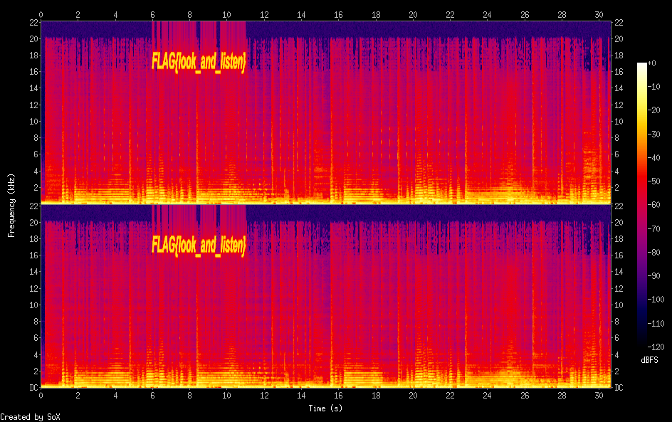

# PhantomSounds

Category: Forensics

## Description

> It's a catchy song... but is there more than meets the eye?

A `*.wav` file, `spectrogram_challenge.wav`, was attached.

## Solution

As the file name suggests, we should check the spectrogram:

```console
┌──(user@kali3)-[/media/sf_CTFs/google/PhantomSounds]
└─$ sox spectrogram_challenge.wav -n spectrogram
```

The result:



The flag: `FLAG{look_and_listen}`