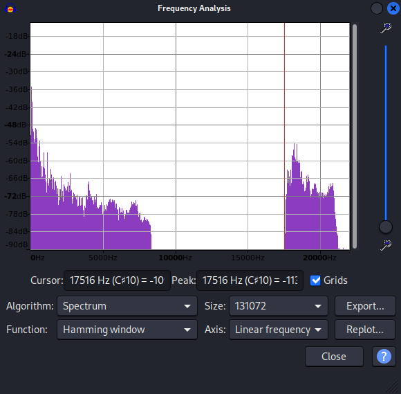

# PitchPerfect

Category: Forensics

## Description

> My little nephew loves this song -- says there's stuff about it us old-timers just wouldn't get. Not sure what he means.

A WAV file, `freq_mod_challenge.wav`, was attached.

## Solution

Listening to the WAV file, we hear a short musical segment.

Let's start by checking the EXIF information for the file:

```console
┌──(user@kali3)-[/media/sf_CTFs/google/PitchPerfect]
└─$ exiftool freq_mod_challenge.wav | grep Comment
Comment                         : "Audio Steganography: The Art of Hiding Secrets Within Earshot - Part 2 of 2"
```

This is a very big hint, pointing us to [this blog post](https://sumit-arora.medium.com/audio-steganography-the-art-of-hiding-secrets-within-earshot-part-2-of-2-c76b1be719b3) about 
audio steganography. The blog post details two audio steganography methods: First, by
hiding information in the LSB of the audio data, and second, by using "Frequency Modulation 
based Steganography". Since the WAV file is called `freq_mod_challenge.wav` (and the description 
hints towards high frequencies), we'll focus on the second method.

Using frequency modulation, it is possible to hide extra information in a frequency range which
is not in the human audible spectrum. We can inspect the file's frequency analysis using Audacity,
by selecting `Analyze -> Plot Spectrum`:



We can clearly see here two distinct frequency ranges, the second one starting around 
`17500` Hz. This range is not only outside the human audible spectrum, it's also the exact 
same range used by the blog post to hide the extra data. Therefore, we can follow the post's 
instructions as-is, and use `Tools -> Nyquist Prompt` to execute `(mult *track* (hzosc 17500.0))` 
in order to extract the secret data.

Once we do this, we are able to listen to the audio again and this time hear someone spelling
out very clearly "F-R-E-Q-U-E-N-C-Y". Turns out this isn't the flag, but instead the password
to the second phase of the challenge, which uses `steghide` to hide the flag in the WAV file:

```console
┌──(user@kali3)-[/media/sf_CTFs/google/PitchPerfect]
└─$ steghide extract -sf freq_mod_challenge.wav -p frequency
wrote extracted data to "flag.txt".

┌──(user@kali3)-[/media/sf_CTFs/google/PitchPerfect]
└─$ cat flag.txt
FLAG{high_in_the_clouds}
```


