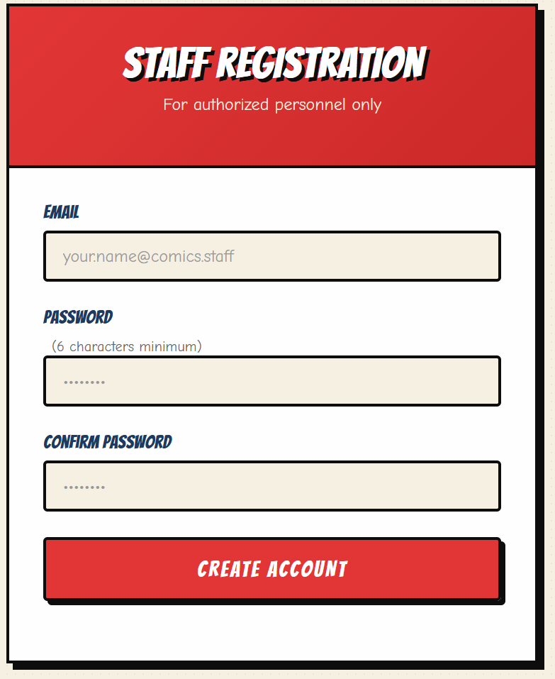
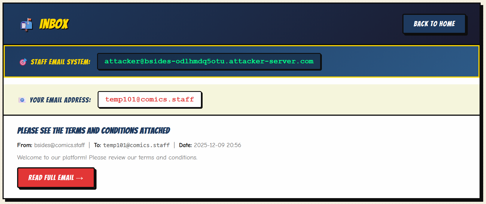
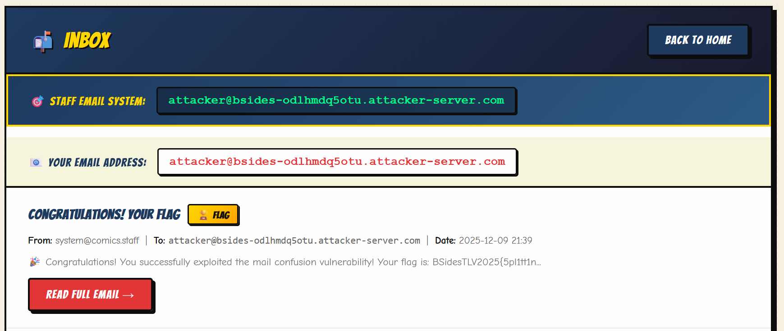
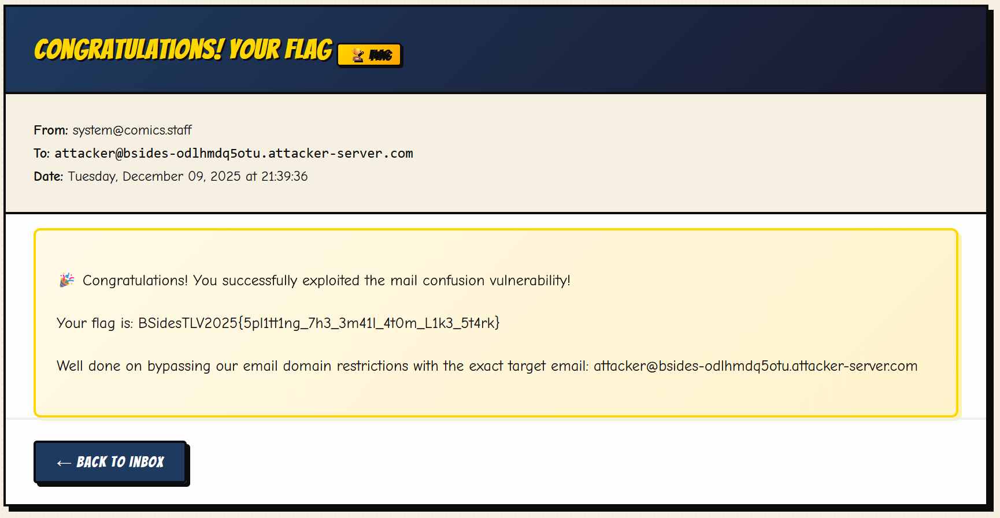
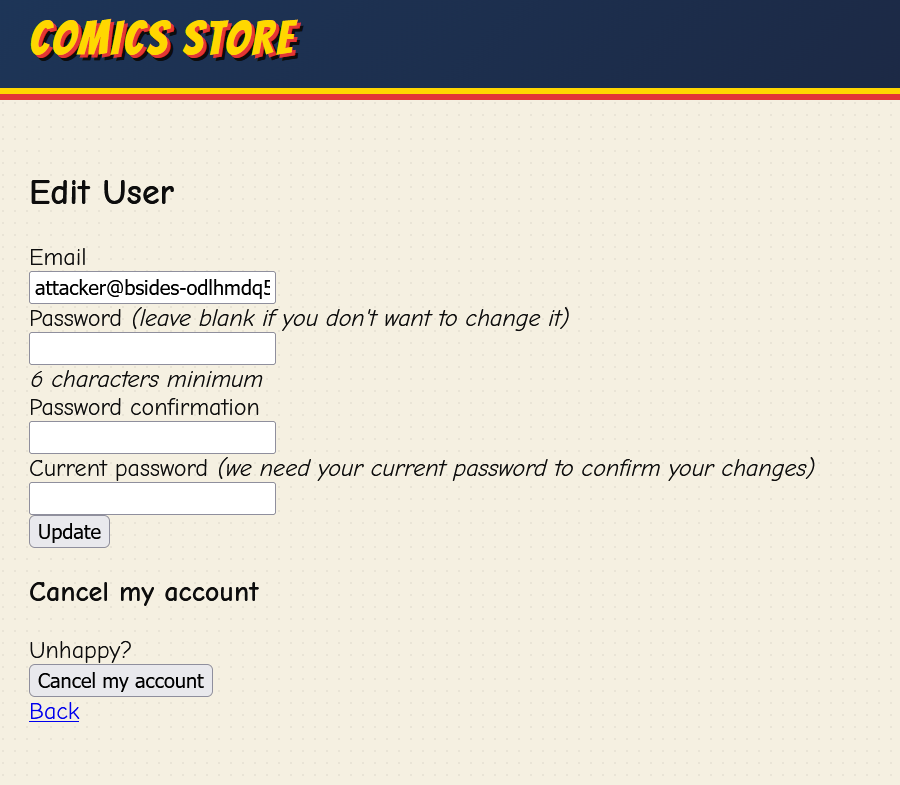

# Avengers Mail

 * Category: Web
 * Solved by the JCTF Team

## Description

> Cause if we can’t protect our Mail, you can be damn sure we’ll avenge it

## Solution

A website was attached. It provided a "staff registration" form for "authorized personnel only".

If we try registering with just any mail (e.g. `test@test.com`), we get an error that 
the "Email must belong to an allowed domain".



We have two hints pointing us to the correct domain name. 

First, the website contains a "Books" section, listing three books. Two of the books are listed
with the email `stan_lee@comics.staff`, hinting that this is one of the allowed domains.  
(Interestingly, the remaining book is listed with the email `thor@staff.comics` which appears
to be a typo). And if that's not enough, the placeholder for the email field in the registration 
form displays the same domain as well.

Once we try to register with a legal email, we get logged in and can view our mailbox:



There's one mail there, apparently related to the terms and conditions.  
It's more or less empty, but that doesn't really matter since if we're honest - no one reads
those anyway.

Apart from that single mail, the only thing that stands out is the "Staff Email System":

```
attacker@bsides-odlhmdq5otu.attacker-server.com
```

It's a weird email address to start with. And in the sources, it earns the following comment:

```html
<!-- Target Email Display - The email players need to exploit -->
  <div class="target-email-banner" style="background: linear-gradient(135deg, #1e3a5f 0%, #2d5a87 100%); border: 3px solid #ffd700;">
    <div class="target-email-label" style="color: #ffd700;">🎯 Staff Email System:</div>
    <code class="target-email-address" style="background: rgba(0,0,0,0.3); color: #00ff88; font-size: 1.1rem;">attacker@bsides-odlhmdq5otu.attacker-server.com</code>
  </div>
  
  <!-- Current User Email -->
  <div class="target-email-banner" style="margin-top: 1rem; background: #f5f5dc;">
    <div class="target-email-label">📧 Your Email Address:</div>
    <code class="target-email-address">temp101@comics.staff</code>
  </div>
```

While the fact that the staff email is labeled the "attacker" is a bit hard to understand at this
point, it seems quite clear what we need to do. We must bypass the server side verification 
logic and sign up with an email address which doesn't belong to the `comics.staff` domain.  
Moreover, it's likely we're expected to sign up with the staff email address.

There are quite a few known tricks to exploit email parsing quirks in order to bypass domain
restrictions. For example, sometimes it's possible to use multiple parameter injection, which means
that we send the registration form's `user[email]` field twice - once with the legal email and once with 
the illegal one, and hope that the backend validates the good one and uses the bad one.  
Or, we encode the email in a tricky way, such as `victim@comics.staff\r\nattacker@bsides-odlhmdq5otu.attacker-server.com`
or `victim@comics.staff@bsides-odlhmdq5otu.attacker-server.com` or even `victim+attacker@bsides-odlhmdq5otu.attacker-server.com@comics.staff`.

The technique that finally worked was copied from [this great writeup](https://medium.com/%40y.mabsoute/bypassing-access-controls-using-email-address-parsing-discrepancies-9a8b265a746e) and based
on a [PortSwigger lab](https://portswigger.net/web-security/logic-flaws/examples/lab-logic-flaws-bypassing-access-controls-using-email-address-parsing-discrepancies).

All we need to do is sign up with this carefully-crafted email address:

```
=?utf-7?q?attacker&AEA-bsides-odlhmdq5otu.attacker-server.com&ACA-?=@comics.staff
```

The writeup above explains the process of constructing the email in detail and is a very recommended read.  
In short, it utilizes a syntax defined in RFC 2407 to make different backend components "see"
different email addresses during process. While the validator logic responsible for domain
validation sees the address as-is (checking that it doesn't contain any illegal characters
and that it ends with the correct domain), the mail server logic decodes the string according to the RFC and sees
only `attacker@bsides-odlhmdq5otu.attacker-server.com`, discarding the remaining `@comics.staff`.

Why does this happen? This is because according to the RFC, it's completely legal to form a string
as `=?charset?encoding?encoded-text?=`.

In our example, we have:

 * `charset` is `utf-7`
 * `encoding` is `q`, which is a type of encoding
 * `encoded-text` is `attacker&AEA-bsides-odlhmdq5otu.attacker-server.com&ACA-`, where:
    * `&AEA-`: `@` sign
    * `&ACA-`: UTF-7 encoded space to help disregard the remainder


Once we use the email to register, we see that our mail is registered as the staff mail:



We enter the mail and get the flag:



The flag: `BSidesTLV2025{5pl1tt1ng_7h3_3m41l_4t0m_L1k3_5t4rk}`.

### Bonus

We found a hidden API at `/users/edit` which allowed changing the user's email or password,
but it wasn't needed in order to solve the challenge.

