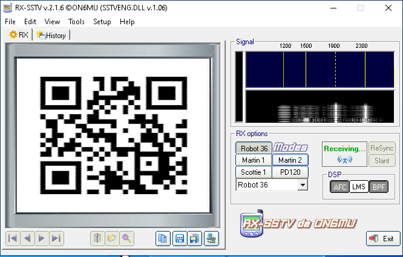

# FieldStream-X

 * Category: Radio Frequency
 * Solved by the JCTF Team

## Description

> A suspicious broadcast resembling low-grade television propaganda was captured by forward-deployed SIGINT assets.
> 
> The source appears to originate from a contested zone. Command suspects it may contain embedded visual intel from enemy units or field operatives.
> Your task is to analyze the intercepted transmission and determine what actionable intelligence — if any — is hidden within.

A `*.wav` file was attached, together with the following text file:

```
Intercept Log #4729-A
Time: 0326Z
Origin: Unconfirmed low-power field station
Medium: Analog transmission, visual-encoded
```

## Solution

The description hints strongly that the WAV file we received is an SSTV Transmission:

> Slow-Scan Television (SSTV) is a method of transmitting still images over audio channels, originally used by amateur radio operators. Instead of sending video frames, SSTV converts an image into sound tones that represent pixel data line by line.

There are several programs to translate the audio to an image, and most of them are horrible.  
We used RX-SSTV which did a decent job after several attempts:



The resulting QR code took us to a Telegram channel containing another WAV file and the following text:

```
Intercept Log #4730-B
Time: 0344Z
Source: teletype

We can clearly hear some Morse, but it feels like a distraction. The other signal... it's a rhythmic, two or more -tone chirp. It sounds less like code and more like an old teletype machine printing data.

https://www.sigidwiki.com

Flag Format: BSidesTLV2025{…} remove the 50...50
```

This time the description seems to be hinting that this is an RTTY (Radio TeleTYpe) transmission:

> RTTY (Radio Teletype) is a digital communication mode that sends text as audio tones over radio or audio files. 

It turns out the RTTY decoding software might even be worse than SSTV software. We struggled with `fldigi` for a while
and eventually gave up and moved to `minimodem` which was much more beginner-friendly.

```console
┌──(user@kali3)-[/media/sf_CTFs/bsides/FieldStream-X]
└─$ minimodem -a --rx rtty -f spectrum-capture.wav
spectrum-capture.wav: input stream must be 1-channel (not 2)
```

Looks like the WAV file is stereo, we can try to separate both channels and try each, or convert the file
directly to mono. The best results came from the right channel together with the following configuration:

```console
┌──(user@kali3)-[/media/sf_CTFs/bsides/FieldStream-X]
└─$ minimodem -a --rx rtty -f spectrum-capture.wav
spectrum-capture.wav: input stream must be 1-channel (not 2)

┌──(user@kali3)-[/media/sf_CTFs/bsides/FieldStream-X]
└─$ sox spectrum-capture.wav right.wav remix 2

┌──(user@kali3)-[/media/sf_CTFs/bsides/FieldStream-X]
└─$ minimodem -a --rx rtty --stopbits 1 -f right.wav
### CARRIER 45.45 @ 1590.0 Hz ###
TPXSIDZSTLV2025RF101CTFSPGINT50

### NOCARRIER ndata=129 confidence=5.507 ampl=0.638 bps=45.89 (1.0% fast) ###
### CARRIER 45.45 @ 600.0 Hz ###

### NOCARRIER ndata=1 confidence=3.197 ampl=0.068 bps=45.45 (0.0% fast) ###
### CARRIER 45.45 @ 600.0 Hz ###

### NOCARRIER ndata=1 confidence=7.956 ampl=0.069 bps=45.45 (0.0% fast) ###
```

We can see that it extracted `TPXSIDZSTLV2025RF101CTFSPGINT50` which is almost the flag.  
We know that we should ignore the `50` at the end from the instructions, and the `TP` at the
beginning is likely an [ITA2](https://en.wikipedia.org/wiki/Baudot_code) encoding error due to 
missing a FIGS signal:

> In ITA2, characters are expressed using five bits. ITA2 uses two code sub-sets, the "letter shift" (LTRS), and the "figure shift" (FIGS). The FIGS character (11011) signals that the following characters are to be interpreted as being in the FIGS set, until this is reset by the LTRS (11111) character.

In the following ITA2 cheat sheet we can see that `5` can be misinterpreted as `T` and `0` can be misinterpreted as `P` if the FIGS control character was missed.


From here, we can guess the flag (characters which were corrected are marked):

```
TPXSIDZSTLV2025RF101CTFSPGINT50
50BSIDZSTLV2025RF101CTFSIGINT50
^^^                     ^
```

The flag: `BSidesTLV2025{RF101CTFSIGINT}`

After the competition ended, one of the participants (`captainB`) shared in the Discord channel the
following command, which gives a much more accurate result:

```console
$ minimodem --rx --baudot --startbits 1 --stopbits 1 -f right.wav 50
### CARRIER 50.00 @ 1590.0 Hz ###
50VVBSIDESTLV2025RF101CTFSIGINT50
```

According to his explanation, he looked at the spectrogram and determined that shortest signal length is 0.02 seconds. 
Then, using an LLM, he deduced that it's baud rate is 50.