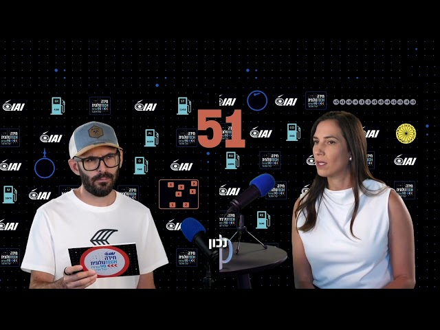
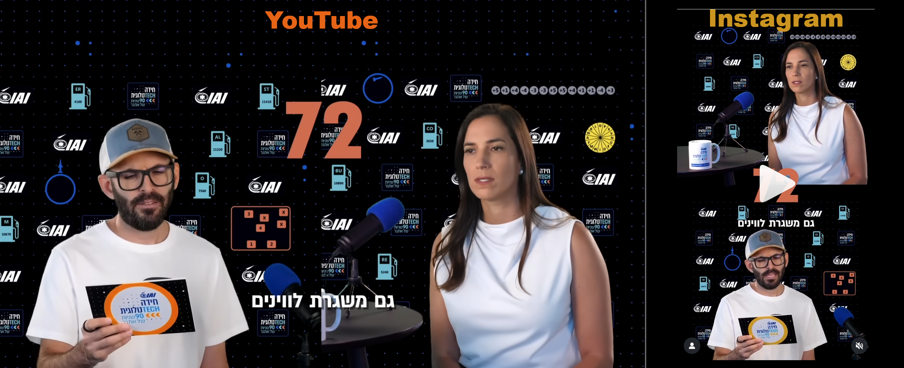
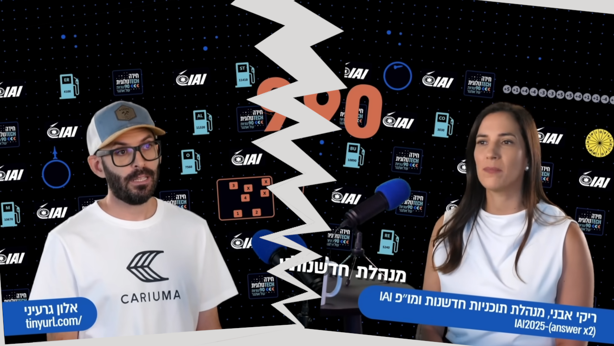
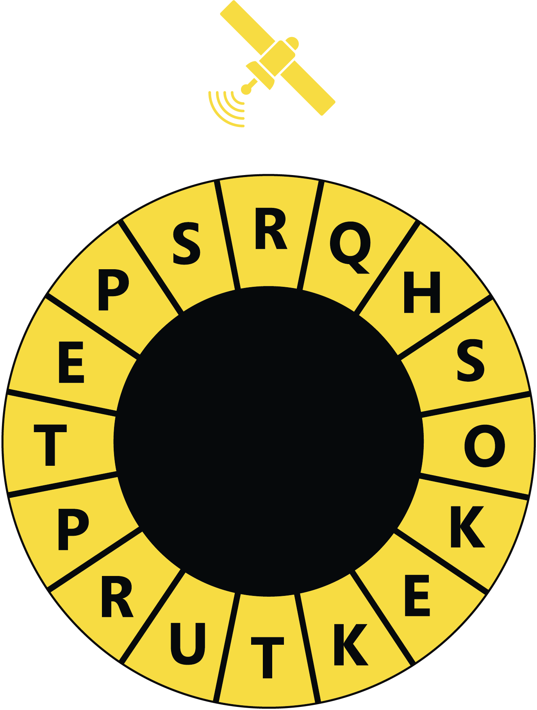
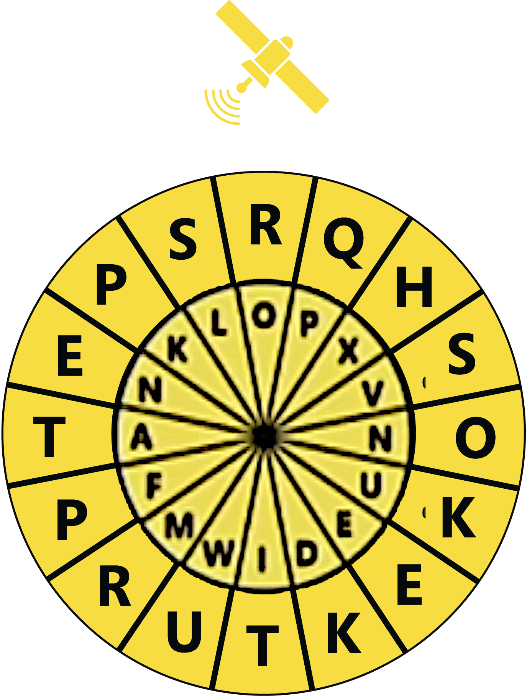
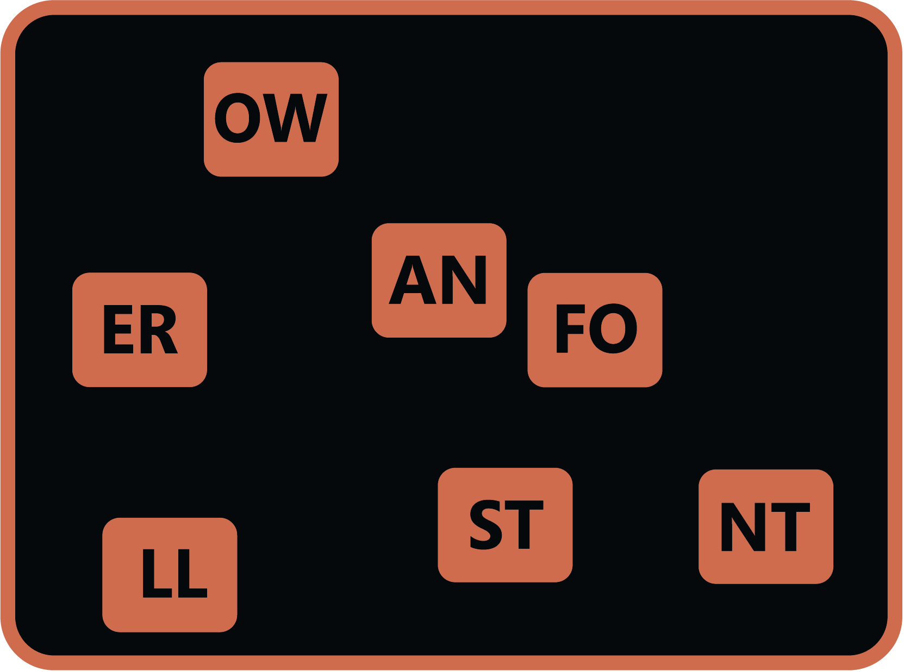
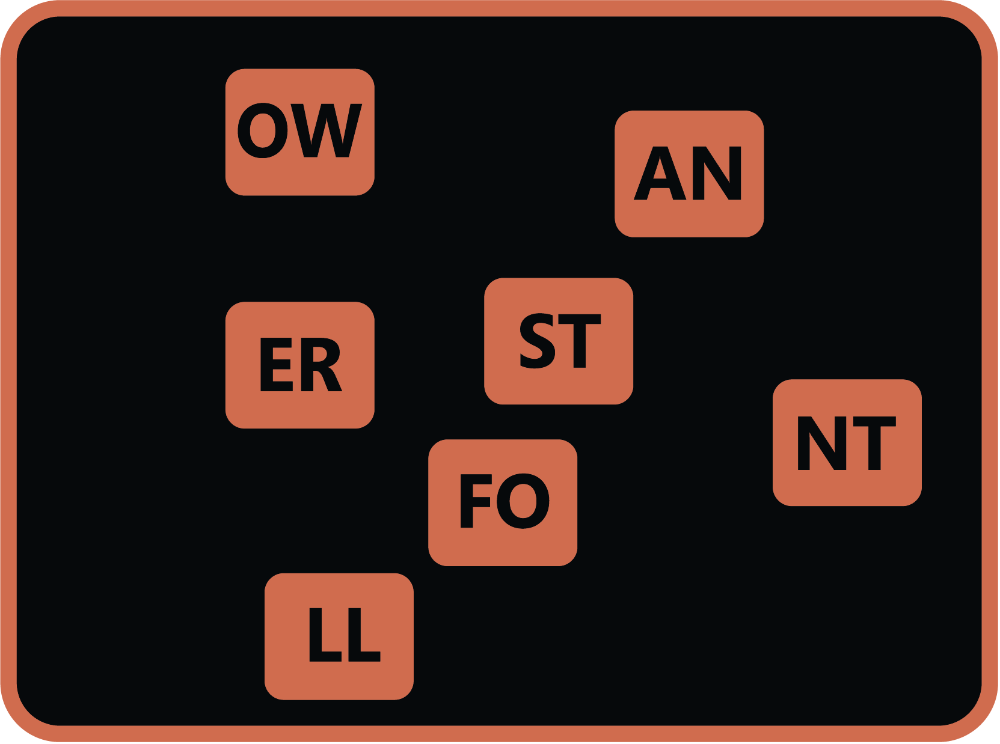
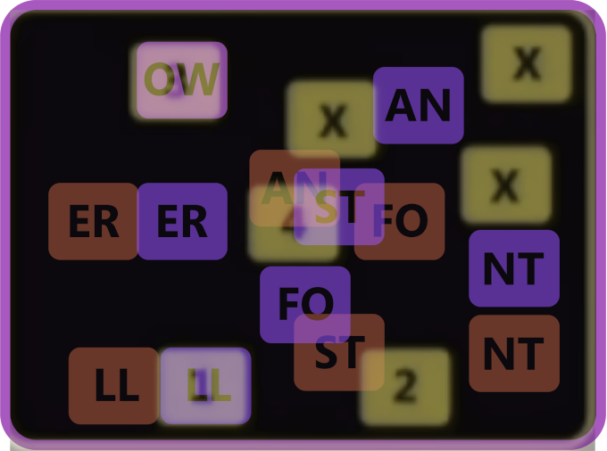
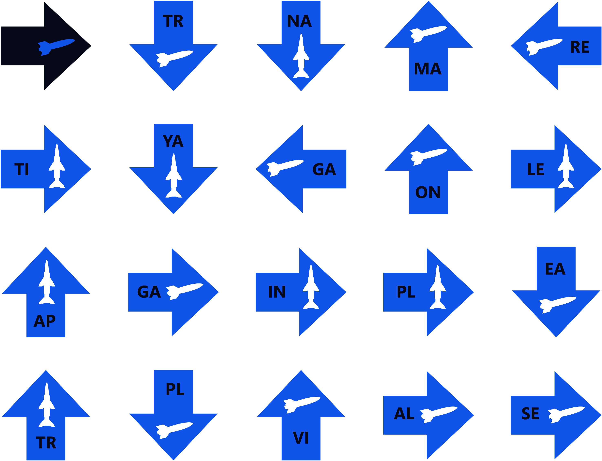
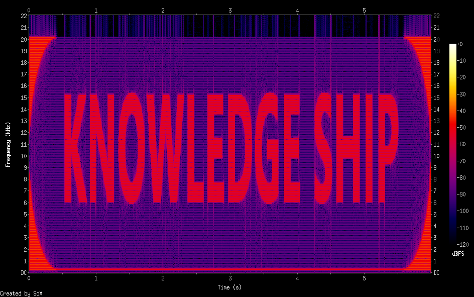

# 2025 IAI Tech Riddle

This is a writeup for the 2025 IAI Tech Riddle.  
The riddle was advertized in the [IAI Jobs website](https://jobs.iai.co.il/riddle/) in the 
form of a [YouTube Video](https://www.youtube.com/watch?v=26AA9x9pAq4), also available
on [Instagram](https://www.instagram.com/reel/DQtSN7djOv4/).  
Solved it together with *zVaz* and *blurey*.

## Introduction

The set of challenges composing the riddle is hidden within a short
interview with Riki A., Director of Innovation and Corporate Development at the IAI.



The interviewer, Alon G., asks Riki a set of questions. Her responses contain hints needed in order to decipher the strange icons in the background.

One key observation (which took quite a while to arrive to) is that each question the interviewer asks is read from a different card, and each card has a different color which matches the color of some items in the background. This was especially hard to understand since the colors on the YouTube were somehow distorted. 



In the image above we can see the a comparison of the same frame from both the YouTube video and the Instagram video. While the Instagram video on the right shows the intended color (yellow, matching the color of the wheel over Riki's shoulder), the YouTube video shows the color as orange. This effect was seen for several other colors as well, making it much harder to make the connection between the question & answer and the relevant items in the background to match them (if you're a boomer watching the YouTube version, that is).

## Flag Format

The flag format was introduced as part of the participants' titles:

 * Alon had `tinyurl.com/`
 * Riki had `IAI2025-(answer x2)`

This means that once we have an answer `ANSWER`, we should try to access `https://tinyurl.com/IAI2025-ANSWERANSWER`.

Note that since the Instagram video was edited as top-down instead of side-by-side, the flag format fragments were reversed. Also, in the Instagram video, Riki's cup was visible, and on it was the flag format as well.



## Challenge #1: Light Blue

In this question, Riki is asked how much fuel a jet can carry, and
responds that thanks to different developments an F-15 can carry up to 36,000 pounds.

In the background, we have fuel icons, and each icon is assigned a number and a set of characters. Let's try to see of there's any combination that can give us exactly 36,000, using the following (AI-generated) code:

```python
arr = [
    ("M", 10670),
    ("ER", 4100),
    ("O", 7560),
    ("AL", 11320),
    ("ST", 11410),
    ("BU", 10890),
    ("RE", 5240),
    ("CO", 3030)
]

def find_subsets_by_value(items, target):
    values = [v for (_, v) in items]
    labels = [l for (l, _) in items]
    results = []

    def backtrack(i, cur_sum, path):
        if cur_sum == target:
            results.append(path.copy())
            return
        if cur_sum > target or i >= len(values):
            return
        # include current
        path.append(i)
        backtrack(i + 1, cur_sum + values[i], path)
        path.pop()
        # exclude current
        backtrack(i + 1, cur_sum, path)

    backtrack(0, 0, [])
    # convert index lists back to (label, value) tuples
    return [[(labels[idx], values[idx]) for idx in idx_list] for idx_list in results]


target = 36000

subsets = find_subsets_by_value(arr, target)
if subsets:
    print(f"Found {len(subsets)} subset(s) summing to {target}:")
    for subset in subsets:
        print(subset)
else:
    print(f"No subset sums to {target}.")
```

Output:

```console
┌──(user@kali3)-[/media/sf_CTFs/iai]
└─$ python3 light_blue.py
Found 1 subset(s) summing to 36000:
[('M', 10670), ('ST', 11410), ('BU', 10890), ('CO', 3030)]
```

Great, we found one match! But what does this spell out? Let's try finding all the different words we can construct from these substrings:

```python
for subset in subsets:
    for ordering in [list(perm) for perm in permutations(subset)]:
        word = "".join(label for label, _ in ordering)
        print(word)
```

We get:

```
MSTBUCO
MSTCOBU
MBUSTCO
MBUCOST
MCOSTBU
MCOBUST
STMBUCO
STMCOBU
STBUMCO
STBUCOM
STCOMBU
STCOBUM
BUMSTCO
BUMCOST
BUSTMCO
BUSTCOM
BUCOMST
BUCOSTM
COMSTBU
COMBUST
COSTMBU
COSTBUM
COBUMST
COBUSTM
```

To filter the list easily, we can check each word against `aspell`, an open-source English spellchecker using:

```console
$ python3 light_blue.py | while read w; do aspell -a --mode=none <<<"$w" | grep -q '^*' && echo "$w"; done
COMBUST
```

Our flag is `https://tinyurl.com/IAI2025-COMBUSTCOMBUST` which takes us to the next level.

## Challenge #2: Yellow

We are redirected to a Google-Drive folder containing the following file:



This immediately reminds us of the other wheel in the background, over Riki's shoulder. In fact, it looks like one fits into the other.



This was the hardest challenge of the series, and it took us a few days to figure out what exactly we were expected to do. Initially, this looks like a standard cipher wheel, used as part of simple substitution ciphers: Each character on one wheel maps to the matching character on the other wheel, while some key determines the rotation state of the wheels. However, in our case, both wheels had duplicate characters, which would cause ambiguity when trying to encrypt or decrypt messages. Also, it was not clear what ciphertext should we be trying to decrypt.  
We spent a long time trying to "walk" the wheels using the sequence of numbers on the top right corner, before understanding the challenge's color-system and convincing ourselves that it belongs to a different challenge.

In this part of the interview, Riki explained how usually satellites are launched to the east, to take advantage of Earth's eastward rotation, however Israel launches satellites to the west due to safety considerations. 

The solution turned out to be picking the bigram from each of the four cardinal direction in the following order:

 * North: `RO`
 * West: `TA`
 * South: `TI`
 * East: `ON`

Is this because the satellites are launched to the west? Possibly. Anyway, the word `ROTATION` given us `https://tinyurl.com/IAI2025-ROTATIONROTATION` which takes us to the next level.

## Challenge #3: Orange

We get two images:




If we compare the two images, we can see that some of the boxes are moving.

This looks very much related to the "map" in the background. We can stack all the images on top each other to get a sense of where each box is going:



The boxes from the first image remain orange, while the boxes from the second image were transformed to purple in order to easily distinguish between the "before" and "after" states.

In this part of the interview, Riki explains how realtime navigation challenges can be overcome by using AI to predict where to fly to. It looks like we need to predict where each box will jump to next. We should then select the bigrams that have landed on the boxes numbered 1-4, ignoring the ones that have landed on an X.

We get:

 * 1: `LL`
 * 2: `FO`
 * 3: `OW`
 * 4: `ER`

Again, we use Python to list all permutations and `aspell` to filter in valid words:

```console
┌──(user@kali3)-[/media/sf_CTFs/iai]
└─$ python3 -c '
from itertools import permutations
for ordering in permutations(["LL","FO","OW","ER"]):
    print("".join(ordering))
' | while read w; do aspell -a --mode=none <<<"$w" | grep -q '^*' && echo "$w"; done
FOLLOWER
```

We visit `https://tinyurl.com/IAI2025-FOLLOWERFOLLOWER` to proceed to the next level.

## Challenge #4: Blue

We get the following image:



In this section of the interview, Riki explains that the difference between "Arrow 2" and "Arrow 3" is that "Arrow 2" intercepts missiles inside the atmosphere and "Arrow 3" intercepts them outside the atmosphere. Based on the blue diagrams in the background and using this explanation, we can now differentiate between the icons resembling "Arrow 2" and "Arrow 3".

This puzzle is simple. We start from the top left corner, skip two arrows for "Arrow 2" and 3 arrows for "Arrow 3". We get `NA-VI-GA-TI-ON`, leading us to `https://tinyurl.com/IAI2025-NAVIGATIONNAVIGATION`

## Challenge #4: Gray

This is the final challenge. In this challenge, we get a text file called "final_url_format.txt" with the contents of `tinyurl.com/iai2025-answer`, and a WAV file called `hidden_words.wav`.

The contents of the Wav file is indistinguishable, but the spectrogram is quite interesting:

```console
┌──(user@kali3)-[/media/sf_CTFs/iai]
└─$ sox hidden_words.wav  -n spectrogram
```



Combined with the gray sequence of numbers, even an LLM was able to figure out what to do:

```python
key = "KNOWLEDGESHIP"
moves = [5, 1, 4, -4, -3, -3, 5, 5, 4, 1, 1, -4, 3]

for i, m in enumerate(moves):
    print(chr(ord(key[i]) + m), end='') 
```

Output:

```console
┌──(user@kali3)-[/media/sf_CTFs/iai]
└─$ python3 gray.py
POSSIBILITIES
```

The link `https://tinyurl.com/IAI2025-POSSIBILITIES` took us back to the initial landing page, concluding the challenge.